# TizuMark 功能演示

欢迎使用 TizuMark！这份文档展示了编辑器支持的全部 Markdown 语法。打开**大纲面板**，你可以在左侧看到本文档的完整目录结构。

## ✨ 软件特色功能速览

TizuMark 不止是一个 Markdown 编辑器，它在几个关键场景上做到了"开箱即用、无需折腾"：

- ⚡ **极速轻量**：基于 Rust + Tauri v2（系统原生 WebView），安装包约 **7MB**、内存占用 **< 50MB**，双击一秒即开。
- 👁️ **实时预览所见即所得**：左边写、右边渲染，滚动自动同步，无需切换窗口。
- 🧭 **智能大纲导航**：自动解析标题层级，一键跳转任意章节，长文档永不迷路。
- 📐 **内置 KaTeX 数学公式**：行内公式、独立公式块、矩阵、方程组全支持，写作/论文/笔记直接搞定。
- 📊 **内置 Mermaid 图表**：流程图、时序图、甘特图、类图、状态图……用代码画图，**自动跟随明暗主题切换配色**。
- 📤 **多种导出**：HTML 单文件（完整样式、完全离线）、高清长图 PNG，且导出图片相对路径解析与预览一致。
- 🖼️ **图片粘贴即插入**：截图/拖拽直接粘贴，支持 assets 目录存储或 Base64 内联，自动去重。
- ⌨️ **快捷键全自定义**：每一条快捷键都可在 `文件 → 快捷键设置` 中改键，符合你的肌肉记忆。
- 📂 **多标签页 + 工作区**：同时编辑多个文件、拖拽批量打开、文件夹工作区、`.md` 文件关联。
- 🎨 **个性化主题**：亮色 / 暗黑 / 跟随系统一键切换，字体、行高、内容宽度自由调节。

> 下文是完整语法演示。想快速体验特色功能，直接跳到 [数学公式](#数学公式)、[流程图与图表](#流程图与图表)、[提示框callout](#提示框callout) 几个小节即可。

---

[TOC]

---

## 基础文本格式

TizuMark 支持所有 GFM（GitHub Flavored Markdown）标准格式，同时扩展了多种实用样式。

- **粗体文本**：用 `**text**` 包裹 — 这是 **重点强调** 的内容
- *斜体文本*：用 `*text*` 包裹 — 这是 *需要区分* 的术语
- ~~删除线~~：用 `~~text~~` 包裹 — 表示 ~~已废弃~~ 的内容
- `行内代码`：用 `` ` `` 包裹 — 变量名 `userName`、命令 `npm install`
- ==高亮标记==：用 `==text==` 包裹 — 这是 ==重点段落==，像荧光笔一样醒目

上标和下标：水的化学式是 H<sub>2</sub>O，质能方程 E=mc<sup>2</sup> 是物理学的基石。

> 当前版本按原样显示（`...` 仍显示为 `...`，`--` 仍显示为 `--`）。需要特殊标点请在输入法中直接键入。

---

## 标题层级

TizuMark 的大纲面板会自动解析标题，点击即可快速跳转。当前版本按原样显示（标题锚点由程序自动根据标题文字生成）。

### 三级标题：常用的章节分隔

#### 四级标题：段落内的小节

##### 五级标题：更细粒度的分组

###### 六级标题：最细粒度的标注

---

## 超链接与图片

### 超链接

- 标准链接：[TizuMark 项目仓库](https://gitee.com/tizu/tizu-mark)
- 参考式链接：[TizuMark][ref-example] — 正文中使用引用标记，文档底部统一定义 URL
- 自动链接：直接写 https://www.tizumark.app 会被自动识别为可点击链接
- 邮箱链接：contact@tizumark.app 同样自动链接

[ref-example]: https://gitee.com/tizu/tizu-mark

### 图片

TizuMark 支持网络图片、相对路径、绝对路径三种来源。图片在预览中会转为内联渲染，无需担心加载问题。下面依次展示每种写法的**渲染效果**与**对应语法**：

**1. 远程/网络图片**（URL 直链，原样渲染，无需本地文件）


```markdown

```

**2. 相对路径图片**（相对于当前 `.md` 文件所在目录，移动文件夹仍有效）

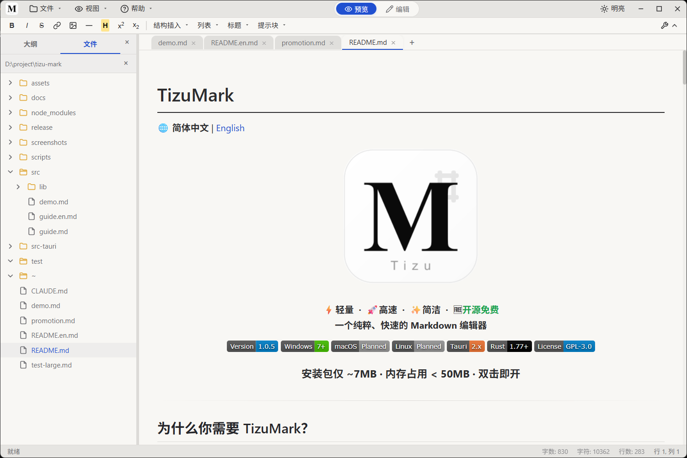

```markdown

```

说明：若文档在 `docs/note.md`，则实际读取 `docs/screenshots/01-main.png`。

**3. 绝对路径图片**（Windows 盘符或 Unix 绝对路径，固定位置不受移动影响）

`file://` 协议写法同样支持：`file:///D:/project/tizu-mark/screenshots/01-main.png`。

```markdown

```

**4. 指定显示尺寸**（需用原始 HTML `` 标签，无 `` 简写语法）


```html

```

插入图片对话框自动生成带 `width` / `height` 的 `` 标签；也支持百分比：`width="100%"`。

**5. Base64 内联图片**（粘贴截图时自动生成，也可手动编写）

![image](data:image/png;base64,iVBORw0KGgoAAAANSUhEUgAAAQAAAAEACAYAAABccqhmAAAACXBIWXMAAAsTAAALEwEAmpwYAAAgAElEQVR4nO2deZAV1fXHX7bfH8NiXMAN3JAIgiaQSLngkqigCJJEiPFnxSw/VOKCShS3MsHEREpEYkxMkWAkBomGxRAEV5SEoCyKYYYo+z4MDAybwEz3vY/zq2/nXeplnO55W/e53X1O1bcYHZh5r9/5fO+5eyYjISEhISEhISEhISEhISEhISEhISEhISEhISEhISEhISEhISEhISEhYU0Q0XFEdAkR3URE44hoVjabfSebzVZns9m12Wx2VzabdQ4dOkSicJ9BNpuNjbTWjtZ6l9Z6rda6WmuNnEHuPK61vkkphZw6jju/JfKCiD5FRD2JaAQRvUREDZQLpRQ1NjbSxx9/THv37qU9e/bQ7t27adeuXbRz505RyM9gx44dsVNDQ4OXH8gT5Aty5+DBg+Q4Tr5R7Mxmsy9prUfkcu9TAmWEQUSfJaKriOh5ItpuYD9w4ID34W3fvp22bt1KtbW1h4X/rquro23btlF9fb33YYsJCPw7mhkAcgM5glxpKYeQWzCJ/fv3HzYFrfX2bDb7vFJqAHJTzCA88HsQ0RgiqkN5idYdTo0PzHxI+BofEFp8fEhNTU34gKTUj7C7w13KV1IqV0Uil1ARoNFonm9odFAlIM+01g3ZbHYCEfUVI6hcif91IlqMlh6uiw8CDo0PAH/iA8AHhA/LhPTtecY3uIGNSo7jeN0DNDb5uYgGCYaRqwwWKaUGSxehNPA/TUSDiOh9JBYAR/llSjFAj9a9pRD4Bf6oDaGxsdEzA9NtQK7CIHJVQY3W+gbpHhQOP8BfBZDxEE3JhT4a+vn4/34h8Av8nJWB1tprrJCrpouQZwQrlVJXldIgpiKI6EQieg4g46GZ0gr9Lr/WXuDnn8rkLsdtrgp25IwAuYyczn1vFhGdws2bNUFEnyOiB4joAPpWGIk14OO/CwluCNIqbsjiZgT19fXef2ut92ut70PuZ9IcRHQSES3Ag8IAiimb8JAKDW4I0ipusOKmgwcPHu7OYgwLg9Za6yVEdFomjUFEV2PhDsp7PBgMoGCEH8kl8PMDLvBnK24CGAvAFLVZl5KrBvZqrYdm0hJE9D9E9CQa73379h0eNc2fxpOWnx9yafmzoVUDaPTMrBYMQWt9KJvNjk98l4CI2hDRK3gI6OPjAaD0L6bVl7Jf4E9KNbBr167DM1xoALPZ7JtE1C6TxCCio4joHbxxs1wX03rFBncLmFZxA5NU7d+/32MB3WAMemutseitQyZJQUQnE9EK13W9vg+ErwV+frAF/qwVXQLDRW5cYA0RdckkCP7NeJPG6Yrt70vLL/AnXa7rHq6McyawGexk4hxEdAwRfWTgxzwo3qzAz9+qS8vPD31LJgBGwAqmDZVSq4no2Ewcg4iq0OfHmxL4+WEW+OMhpdThSiC3mxVjAm0zMZzqex1vxuzDx+CftPz8YEvLb7e01t5goDmXIGcCr8ZqihDz/Hgz5k1In58faoE/HvDrnMzAIBhCFa2UGpeJQxDRQMzWYZ4fZYyM9vNDLfDHC36dZwJgKLdO4JBS6uuZGKztbzAr/GSenx9qgT+e8OucsIsQLGGZvFJql7U7CXP9/kVwLbPCT/r88RA3AGmWDoDfyKwYzB099q6V4wHY0os3hH4LRjGRWDLPzw+3wB9v+LXWh2cGzHiA1npUxsLSfz9affRZZGMPP9gCfzLg183GA3JbiQ9Y1RUgopmYujC7m6Tl54dbWv7kwK9zwjgAGMutFJyesSGI6AoAb85UL6b054YgreIGIM3SJcJvugJgzGyfZz9jkIg+gwM8zUilnOTDD7fAn0z4dU6YWQNrmGlTSq0Ag5wG8L9IOAz8Yd5fWn5+wKXlTy78OiesCzAL7LTW13Je2lFtWn85wJMfcIE/+fBrrb1K21QBWutlLJeP4MYeJBz6JIW2/twQpFXcAKRZusLw51cBZmu9UmoQhwEsxmkmcCI5t58fcoE/PfBrrb1FQWAvd/HIwqjh74UWHaORcCJp+flBl5Y/PfDrnDDzBgbxteM4Z0dpAE+Yef/W1vtzQ5BWcQOQZukI4IfyZ9+UUmOjgv+zuKLbrPpDsgn8/MAL/OmCX+fWBYBBsKiUqo1kSpCIrkKymeuQBX5+4AX+9MGvczJXlOcGA/tFYQDPm2kIuaKbH3iBP73w67zBQHTFlVKTopj734aWH64jfX57xA1AmqWZ4DcCi7lNQlvDNoCzAD3mH/ELZcCPH/w0w4/kx+Yzc7ekOXY+d91WJD9fM8MPYR1O3rmb3cI0gBHoa6DkwBoAGe0X+DkNwFy02ZLwvbB/vrYAfsicwJW7WeiWMA3gJbMZIX/PP3cLmFZxt8Dcym+ZmwvfC/Pn19XVsYNvZE7hyi0KmhqmATSg9MeDEfgFfm4D8IPTKKyfX1tb64kb/HyBScwIKKV2hAX/8Wb1H36RtPzS8qfRAGpz8NtmAM3GATqGYQCX4Ceb/g93+ZtWcUPHpZYG5KJWbR78+UJ3IHdqL5sB4PfjNeJr13UvDMMAbs4fAOQGIY3ihpBTQQNynPDX5gkQchlA/rZ8rfWwMAzgifwFQNwwpE3cAHLLxpa/toVKgMsADJu5S0Urvy+AiGaZ6Qb8Qm4g0iRu+GyQ7fDXMo8L4LjwvENCZlbcALLZ7DumDOMGIk3iBs8WxQH+WuaBwbz1Cf8MwwBq0MdBmcMNRVrEDV2auwC1JcDPvTbAbNDDMWFhGMAG/HBz9LdI4E/qIGBtCfBzDwJCZom+UmpdGAbQgPl/nEIi8Av8UVcAUU0D1pbY8nNPA4a+GCibzTpYbIAjwMQApOy3Qa3BXIrJ6DzZ3N9vSWicc1eJN1XcAAA9DAASA5A+f9IMQLcAVNwMAPBD+FoMIGbjFNwwxVGVMgDtA5QYgFQAAn/CDUAHtKhiAGIA0vIn2AB0KyW1GIAYgJT9CTWAQvrUtTIGIIOA0udPngEUOqhWKwYgBiADfskygGJG1WvFAOw1gBUrVtDjjz8eay1evJgdIhv09NNPl/T8Ro8eHajmf3/s2LFF6Sc/+UmgzN+bPn06+xRg6qYBp06dSlVVVbFWv3792OHj1sKFC9k/h6oyNWTIEHb4xQBiqvfee48dQk4NGzaM/TOoEgOIXwXw5ptv0gUXXHBY559/PvXo0YNOPfVUatu2LXtSFKrhw4ezQ8gl5NLRRx/N/hlUFagTTjiBunXrRl/60peoT58+Xs5Bo0aNYm/9U1cBBAmnoyxfvpwmTpxI3/rWt+iII45gTx4/AQB8aNwwcuiXv/wl+/Ov8lG7du3osssuo0ceeYReeeUVWrlypSwFjosBNNfGjRtpxIgR1lYG48aNY4cxaqGVOvvss9mffVUztWnThm688UZvkFlmAWJaAfhpwYIF1KVLF/Ykay6UlTjSiRvKKIUuHPdzr2qmY445hubMmSPTgHHvAgRp06ZNdMYZZ7AnW3PNnDmTHcoode2117I/86o8oTpEqS/rABIwBtCali5d6vXxuJMuX1dccQU7lFEJJty+fXv2Z16Vp5EjR8pCoKQMAhai733ve+xJ17zviYFLbjij0E9/+lP2552vjh07Hr5VRyqAlBjAiy++yJ54zXX77bezwxm2cHHF6aefzv6s83XdddfJUuAkTQMWojVr1gQmBceMQYcOHbxDHbkhDVNYNuv3/o888kg655xzIn/uTz31lBhA2gwALVHQOACWd3K0Rk8++SQ7pGGqf//+vu8dqwIxFhL1M589e7YYQNoMAAqaEpw7dy6LAfTs2dM7XZYb1DD00UcfeWMdfu990aJFLAZQU1MjBpBGA+jdu7dvUuAC1AsvvJDFBNAiccMahn70ox/5vmcsqcXf4TCA9evXiwGk0QAuueSSQAOYPHkyiwEMHDiQHdZKC88Ta+n93jOeNZcB1Pnc6CMrARNuAIMGDQo0AOwpOOWUUyJPSJTJWIrKDW0l9eyzz/q+386dO9OBAwfYDGD3f67TEgNIWwVwzTXXBBoA/s7PfvazyBMSuuuuu9ihraSwY9PvvT700EOH/x6HATQ2NooBpLELELQc1RgAjpb6/Oc/z7I4BS0TN7iVEAb3/N4nZmLWrVvHZgDt2rWTI8HSagDXX399qwYAffe7343cAKDf/OY37PBWQthd5/cesV07/+9GbQAdO3YUA0irAQSBbQwASfnuu++yGMAXv/hFLzm5AQ7z0A/sCuQ0gE6dOokBpNUAgvYDwADyE/Oiiy5iMYHXX3+dHeKwDv3AeQDNDS5qAzj55JPFAMQAPpkYH3/88X8l5pQpU1gM4Bvf+AY7xKUKcKOKKaaLE7UBdO7cuaQrwW28HlyOBAvRAJqamlg2scR5SjDo0A+/Qc44GkBtTjABMYCEGgDENSWIQye5YS5FQbMsd9xxR4sVQ5wNoM5nQZFUAAkxAOwZx461qA0ArSVaF26gi9GWLVsCD2Otrq7+BPxxN4Da2loxgCQbAPT9738/cgOAJkyYwA51pQ79wI7AluAXA5AxAOsNABd5cBhAr169YjMl2NqhHzNmzGgR/rgbQJ10AZJvAFDQJqIw9dZbb7HDXe6hH9iCjQHVluCPuwHskUHA5CwECjKAF154gcUAhg4dyg53IQqC+NFHH/WFP64GUCfTgPETkrBUA0AL1rVr18gNAMeUrV27lh3wUg/9wJ6K1spkWQikZR1AFPCXYwDQL37xC5Yq4P7772eHPEh3332372tHl6u1KTExAC0GEAX85RrA9u3b6aijjorcAHCoxr59+9hBb0lYPn3iiSf6vvZ33nknVgZQV1dn7YCfrAQsE/5yDYDzaus//OEP7LAXe+jHueeeW1AS22QAe/bssXbATwygTPgrYQC4YYjDAL7yla9YOSXYt29f39c8adKk2BmAUsoDPb8SsGXATwygTPgrYQDQpZdeymIC8+bNYwe+0EM/TLclbgagYybZDFQE/JUygL/85S9st9lwQ1/ooR8YuCw0icUAdNkGgOokU+mI43kArSVtJQwAq944pgSbH6XFKdxmhKu1/aYuV69eLQago6sAxAAKgL9SBgCNGTOGpQrIP0zT1kM/cPBqMUksFYAWAwi75a+0AdTX17NMCeYfp82l1g79eO2118QAdPitP1p9qQCKgL+SBgDddNNNLFXAc889Z+2hH2eddRa5risGoMOHXwygSPgrbQAffPABiwGcd9551h76gYtOi01m6QLokuBPvQGUkryVNADo8ssvZzGBBQsWsMCPeXG/Qz8wKIiSVAxAh97yp94ASk3gShvAtGnTWAzghhtuYDGAoCPSbrvttpKSWioAXRL8qa0AykngShsA+rvdu3eP3ADQCm/evNmqQz+WLVsmBqCjaflTawDlJnGlDQAaO3YsSxWAI7iiNICgagddoVKTWyoAXRL8qTOASiRxGAbQ0NDguygm7CWtUU0JtgYqVkeKAejIWv7UGUClEjkMA4B++MMfslQBuLwkCvhXrlzpe+jHaaed5nvbrlQAOjT4U2MAlUzmsAygpqbGF5AwhSu4w4Yfuueee3xfAwYGy2nlpAugS4I/FQZQ6YQOywCgfv36sVQB2JUXJvx4Ln6HfmAwctOmTWIAOrqyPzUGEEZSh2kAL730EosB4N6CsOCHgg79wHRkuQkvFYAuCf5EG0AY8IdtAJgSPPPMMyM3ABy8uXXr1lDgh9DN8Pvd8+fPFwPQ0bf8iTaAsOAP2wCgcePGsVQBOLA0DPgXL17s+zv79OlTkcSXCkCXBH8iDSBM+KMwAEwJdujQIXIDwEi8uXyjUvBDQRueJk6cKAageVr+RBpA2PBHYQDQrbfeylIFYC6+kvAHrW84/vjjae/evWIAmg/+RBlAFPBHZQDLly9nmRLEWYWVgh8KOvTj3nvvrQj8ae4CqDLhT4wBRAV/VAYARZ3URkuWLKkI/Egov0M/YG64DUgMQLPCnwgDiBL+KA1g5syZLAaAPnu58ENBh34MHjy4oi1h2ioAVSH4Y28AUcMfpQHgA+nRo0fkBnDkkUfStm3byoIf+va3v+37O2bPni0GYAH8sTYADvijNABo/PjxLFXAY489Vhb8W7Zs8T30A1ufsS1YKgDNDn9sDYAL/qgNAEdnc0wJYs++35RgIYkadOgHTK3SJXEaugAqBPhjaQCc8EdtANDtt9/OUgXMmDGjJPhhHH6Hfhx99NHeachiANoK+GNnANzwcxjAhx9+yDIl2L9//6Lhh6ZPn+77M4cPHx5K65jkCkCFCH+sDIAbfC4DgK666iqWKgBHdBUDP3TllVf6/rz33ntPDEDbA39sDIAbem4DePnll1kM4JZbbikK2KBDP772ta+F1komsQJQEcAfCwPgBt4GA2jtJp2wVGyfPejQjz//+c9iANou+K03AG7YbTEACBdmcFQBTzzxREFJG3Tohzl7UCoAbRX8VhsAN+i2GQA2zhx77LGRG0C3bt0KmrcPOvTj4YcfDrVcTkoXQEUMv7UGwA25jQYA3XnnnSxVwN/+9rdWk9fv0I/27dvTxo0bxQC0ffBbaQDcgNtsABhka9u2beQGMGDAgMDkXbp0qe+/vf7660OFPwkVgGKC3zoD4IbbdgOABg0axFIFVFdX+ybwzTff7Pvv5s2bJwag7YTfKgPgBjsuBjBnzhwWAxgxYkTRh3707t3bSyypALSV8FtjANxQx8kAuKYEATk+x2IO/ZgwYULo8Me1C6AsgN8KA+AGOm4GAD311FMsVQCmIpsnsZ8ZdezYkfbs2SMGoO2Fn90AuGGOqwFwTQn27NnTO7rcJPLcuXN9/+7dd98dCfxxqwCUBdBbYQDcIMfZAKCRI0eyVAEYgzDJfN1110Vy5FdSDEBZALwVBsANcRIMgGtK8Oqrr2710I+BAwdGBn9cDEBZALsVBsANcFIMAMLZelEbgGndgw79KGThUJoMQFkAuhUGwA1v0gzgtddei9wAoDvuuIO6du3a4vfOOOOMih/5FWcDUBZAboUBcIObRAPgmhIM6nqMHTs2UvhtNgBlAeBWGAB+ATe4STQA6Omnn47cAIJOFK6rqxMD0PGAPxIDML+AG9ykGgCmBI877jh2+KEbb7wxcvhtrACUBWBbYQBIUDGA8E0g6CCOKIWbgNNuAMoCqMUAUlQBQKtXr2aZEszXRRddxAK/TQagLABaDCBlXQCjb37zm6wGMHny5FQbgLIAZjGAFBvAG2+8wQb/SSedRPv370+tASgLQBYDSLkBIBG//OUvsxjAj3/8Yzb4uQ1AWQCxGEDKDcAk429/+9vI4W/Xrh2tXbs2lQagLABYDCDlBpAPwr59+3xP5g1L1157LSv8XAagLIBXDCDlBtASDPfee2+kMGBLsBiAiq1kHUBMDcAPOpTjKMujgL9Xr15eEokB8IMsBpCiCqA14IYMGRKJAWAZMjf80gVQYgBpMoBCgAg6qadSwpFfu3fvZodfDECJAaTFAIqB4pxzzgnVAO666y528MUAlHQB0mIAxULxu9/9LlQDqKmpYQdfDECJAaTBAEqBArsETzjhhFDgx7QbN/RiAEoGAW0zAEBnA/xG9913XygGMGPGDHboxQCUGACHAXznO9/xBWPXrl3WwA+tW7eu4lOCX/jCF6ipqYkdejEAJQbAYQC47NIPjvr6emvgN8JKvUoawJgxY9iBFwNQsg6AS35n4UNbt261Cn7o7bffjv2RX62pf//+oXR1/NS5c2f2BTyyEIjJAIJa1E2bNlkFf6WnBH/wgx+ww96SLrvsskgNoGPHjuzgigEwGcDQoUN9E2P9+vXWwQ9NnDixIom/cOFCdthb0sUXXxypARxxxBHs4IoBWHjyzqpVq6yD3+wS7NSpU1lJf/7557OD7qe+fftGagBVVVXU2NjIDm8lJJuBigQ1qL+5ZMkS6+A3evDBB8tK+EmTJrGD7qc+ffpEbgC7d+9mh1cMgKECuPDCCwMvzrQRfgjdk/bt25eU7KgeOI/8ak3du3eP3AC2b9/ODq8YQMTw44Hj/LugVtJG+I2CZjCC9MADD7BDHqRyuzelaMOGDezwigFEbADvv/9+YFI88sgj1sIP/f3vfy860bGQaM2aNeyQ+8l13ZIrm3K0cuVKdnjFACI2gIcffjgwKc4991xr4S+1v3zNNdewQx4kTL1GDX9VVZVnptzwigFEXP6feeaZrSZGdXW1tfBDzz77bFGJjhuIuV9zkObPn892D4KyAOByJbMABRrA9OnTC24xbYUfwo5FrGQr5L3g5mEkCfdrDtL48eNZDODBBx9kh1cMIKLW/+DBg975d4UmR0uzAdyg5Ouhhx4q6H386le/Yn+tremrX/0qiwGcd9557PCKAURkABgFLyY5jj/+eFqxYoWV8EMbN25sdeCsQ4cO1NDQwP5ag/T666+zwF+VE34/N8DSBQgZ/l//+tclJQfGC2AC3JD4KWhXI3Tbbbexv8Yg7dmzh3r06MFqAKeffrpnptwQlyMZA/ABH33lO++8s6wEwYk8r776KjsspQyeYTCT+zUGLW2+8sorWeGvygmLkP7973+zgywGUKEWH4ddTJkypaKryzAwuHz5cnZwmgv92JZe7+WXX87+2oKMq3fv3uzgV+XpmGOO8QYjDxw4wA60VAAlQO84jrfTDX39rl27hpIkbdq0oQsuuMA7UAMLimxYWvvHP/6xxdc6depU9tfWfK7/mWeeoUsvvZQd9qpWugSPPvooffDBB+xgSxegBdCXLVvmTd9AOC8P5/thFBkDXlEnS9u2bb0+7ODBg71jxm699VYaNWoU/eMf/4gMLJgQ7rnLf11dunTxdrpF9RqwzsB8JkYjR46k4cOHe2U+jiDjBrsUderUycutYcOG0YgRI7zGJV8wX274UzcGgJaNOzFaE0rJKFvX0aNH/9fv//nPfx7p78fV4tzPnENDhgxhh18MwIJE4DaAzZs3ewdc4HfjT/y3GIAYQCIrgHnz5tGAAQOsFlYcRgmgaYXxu/Enx9Jk7mfOodGjR7O3/qmrAMJQ1MCI/vMMuMFRCZEYgMAfO1PhhkYlSGIA0vKzAy3wKzEA7lJeyn5+uKXlV1IBcMMtfX5+0KXsV8noAmitnSQNAnJDkFZx95OTrPr6eo9P13WbwjCAhp07d1b0zjyBnx9IgV8lRtu2bfO2fbuuuyMMA9iAG3PxS7gBlpafH2Zp+ZW1BqCUWheGAdTgAgVcKMkNsZT9/EBL2a+sE9hEI62UWhaGAbyDgxsqdWuuwM8PpsCvEiWwCUaVUv+suAFks9lZOLyhtrbW+2XcQBcjbgjSKm4g0iTHcTw2wajrujPDMIBxOFATvwRbTLmhFvj5ARf4lTUybGJbuOM4j1XcALTWNxmXwS/hBltafn7IpeVX1gjH3oFNnILlOM7/VdwAiOhiQGf6GdxwS9nPD7qU/coaYYAebOJ6Ndd1+4ZhAMcBOtykivUA3IAHiRuCtIobgrTKdV1vARDYxNdE1CETRmitd2Ke0ea1ANwQpFXcEKRV7n9afI9JNMyO49RnwopsNvsS+v/oa2A8gBt2gZ8ffIFfscOPQfm8GYCpoRmA1nqEGQjEoAM38HFt+d966y2aNWtWwVq6dGnBPxstAf4NTisW+JMPv+u6tHfv3sMDgK7r3hKaARBRT8BmlhxyQx9H+KEXXniBJkyYULBgGIX+7A0bNnj/Zu7cuaG/D24I0io3D37T/weT+LqpqalbmAbwKa31Niw3tGVJMDfMpQizKHiG+Zo9e7YH7pIlSz7xvWLuHcBoMFr/9evXC/wpgN91XY9FNMiO42zNhB3ZbPZ5WxYEcYNcSeFyShhATU0N+2tpTdwQpFVuC/CbMTn86brupNANQCl1FZLAuI7Ab5cBoLrA1WWlHAmOf9eaUGEUk7TYPo5/hxK1+fdw/Ra+t2bNGna4VAzhhzDyDxYxNqeUujx0AyCiz2qt68zCAySOtPz2GEA5YwCFjEesXr26qMTF1Vqma9P8e+je4Hs4Pp0bMBVD+AE9GMRzdF23log+k4kistnsE2bqIeplwdzlb5INoPnYgxEGIfEz//rXv3ojzWIAih1+yGzOQyUVyvp/vyCiXoARK4+iPCKMG9KkG0BLwnXZ+HnPP/+8l3DFJrBUACoU+CF0r8zov+M4Z2eiDK31IrMBIYrBQG5A02gAGzdupN///vc0adIkr69ZShKLAahQ4DeDfzBlx3HezUQdSqmvI0ngQGFXAdxwptEAADyu+oIBwAhKbcXEAFTF4Tetf97g38DIDSC3JqDa9EPCqgK4wUyjAWBl2eTJk72f8+GHH5bVhw0yAMwiySCgKhp+9PnBHD4n13X/BRYzHKG1vg4JAycKowrghjKNBoA1Hrh6HT9j4cKFZQ9iGQNYtGjRJ76H6lEMQBUFv1n5Z1p/x3GGZrgC0w5a65VmLADJI/DH1wCQXC+//LL37994442y4YfMIOL8+fM/8b0VK1aIAaji4Des5Vr/j4jo0xnOUEr1B/RmRBKJJC1/PA3g7bffLnm6z0/r1q3zfuaLL774Xz8TjcW0adPEAFTh8KPFR8tv9v0rpQZkbAhsEzbrAso9LajSpXVcxG0Aq1atOrzYB68Fc//4s7lQ0hdjAMiLP/3pT4dBx79Hd2DKlCnepqhnnnkm1QuB3ALhh7D4zsz7h7rtt9ggos5a6/1YNIKVSXB6gT8+BoBErK6uLmglIF5nsUmOytCMKxihq4HGAjMNaTUAtwj4UTGBrdymnwMHDx48OWNTaK3vNx82ShQklrT8/JVFIfBHJSTvli1bit5PkHb4HcfxuEL5n9vzf0/GtiCiz2mtF5quQDEbhbghSKu4IUir3CLgNxt+8o78XgDWMjZGriuw05xQUsg+AW4I0ipuCNIqt0j4zTobdJccx9nV2Nh4SsbmwKokrfUhzFW2Nh7ADUFaxQ1BWuUWCT8G+8AQWHIc51BTU9PgTBwim82Oxxs2/ZaWDhDlhhiKlxUAAAO8SURBVCCt4oYgrXKLhB9dabADhnKXfYzNxCXQR8lms6+aeUuzY0ngF/i5QYwD/E1NTR43EIzAcZw51vb7/YKIqrTWC/BmUMZgoRAeBncLmFZxQ5BWuSXAj1k0MIOpP8dxFhFR20wcg4iO1lp/CBfDG8IbQ1XADUPaxA1BWuWWAX/ujL9VRNQxE+cgopO11pvNQgbTp+GGIi3ihiCtckvo84ONPPg3W7fYpxwTUEp9BPDNwCDeMDccSRc3BGmVWyT8aBxNnx9fu667prGxsUsmSUFER2FMAF0AU+ZgjpMbkqSKG4K0yi1hnh8s5A34LQ7tck/uIKI2Wus5eOOY28QCB+wfwIPjBiZJ4oYgrXKLXN5rVviBhdxU3xtE1C6T5MB0hlLqCaXUIaxuwgNARSDjAgJ/WuA/ePCg1xXOW+F3yHGcx2M31VdOKKUGKaUa8gc/zCYR7hY0ruKGIK1yi2j1Abwp+XNr+/c0NTUNyaQxcnsH/omHg64AHBFmgCWQ3DDFTdwQpFVuESf5AHqzUS5X8i9ubGw8NZPmyO0iHKWU2o9qAN0B0y+SmQKBP+7wHzhw4PB4F3I7d4nHx9jSm6qSv7UgohOUUs+hNcPIqHFLPDz0mbhbWFvFDUFa5bYCPsp7rH5FDiOXc2f4Af5ZiZnfDyNwzplSagUeMozADJbgYaKMwv/nhs4WcUOQVrkBfXzkbHPw8f9xgKdS6gpuvmIROOkUg4Ra6yXGCEzXwByLlPaqgBuCtMr16d9jSg+5acaxcjf24PvVjuPcENnFnUkKXHiglLoaJw0h6c0oqukemL3ScNk0TSNyQ5BWuXlr9gG4uZrbtPZomHIHdnrXdTU1NQ1iu7QjaUFEZyqlRiul1uPDwIPGzIHpIhjnxYcCk4ArYxARHwY3sAJ/POU4jldpIpcwRY3GJj/fDPS56TzkWq3jOE86jtObm5fEBkop3EWglJqklNpqKgN8SPgwzDJj8yHlf1jmwFL00fBhiuQZ7Mg9A+QEcsOsyW+eP2Y3KxoYtP65wzmRe1td131WKdVPynweQ+iutb5Vaz1NKbXDtLbGvfFhoSKAg6NigEkI+AJ+SznQ0NDgCXmCfEHuoHU3sOeAr3ddd5rrurc0NTV158h5iYDA/mnXdS/SWt+olBqrtZ6JxUZa638ppdZi9aFSyuEu5aXPb13/3nFdtyGXI8gVLFCbiaO4HMcZhpxK7CYdCQkJCQkJCQkJCQkJCQkJCQkJCQkJCQkJCQkJCQkJCQkJCQkJCQmJTDzj/wEHmLKYrIZw/gAAAABJRU5ErkJggg==)

```markdown
![image](data:image/png;base64,iVBORw0KGgoAAAANSUhEUgAAAQAAAAEACAYAAABccqhmAAAACXBIWXMAAAsTAAALEwEAmpwYAAAgAElEQVR4nO2deZAV1fXHX7bfH8NiXMAN3JAIgiaQSLngkqigCJJEiPFnxSw/VOKCShS3MsHEREpEYkxMkWAkBomGxRAEV5SEoCyKYYYo+z4MDAybwEz3vY/zq2/nXeplnO55W/e53X1O1bcYHZh5r9/5fO+5eyYjISEhISEhISEhISEhISEhISEhISEhISEhISEhISEhISEhISEhISEhYU0Q0XFEdAkR3URE44hoVjabfSebzVZns9m12Wx2VzabdQ4dOkSicJ9BNpuNjbTWjtZ6l9Z6rda6WmuNnEHuPK61vkkphZw6jju/JfKCiD5FRD2JaAQRvUREDZQLpRQ1NjbSxx9/THv37qU9e/bQ7t27adeuXbRz505RyM9gx44dsVNDQ4OXH8gT5Aty5+DBg+Q4Tr5R7Mxmsy9prUfkcu9TAmWEQUSfJaKriOh5ItpuYD9w4ID34W3fvp22bt1KtbW1h4X/rquro23btlF9fb33YYsJCPw7mhkAcgM5glxpKYeQWzCJ/fv3HzYFrfX2bDb7vFJqAHJTzCA88HsQ0RgiqkN5idYdTo0PzHxI+BofEFp8fEhNTU34gKTUj7C7w13KV1IqV0Uil1ARoNFonm9odFAlIM+01g3ZbHYCEfUVI6hcif91IlqMlh6uiw8CDo0PAH/iA8AHhA/LhPTtecY3uIGNSo7jeN0DNDb5uYgGCYaRqwwWKaUGSxehNPA/TUSDiOh9JBYAR/llSjFAj9a9pRD4Bf6oDaGxsdEzA9NtQK7CIHJVQY3W+gbpHhQOP8BfBZDxEE3JhT4a+vn4/34h8Av8nJWB1tprrJCrpouQZwQrlVJXldIgpiKI6EQieg4g46GZ0gr9Lr/WXuDnn8rkLsdtrgp25IwAuYyczn1vFhGdws2bNUFEnyOiB4joAPpWGIk14OO/CwluCNIqbsjiZgT19fXef2ut92ut70PuZ9IcRHQSES3Ag8IAiimb8JAKDW4I0ipusOKmgwcPHu7OYgwLg9Za6yVEdFomjUFEV2PhDsp7PBgMoGCEH8kl8PMDLvBnK24CGAvAFLVZl5KrBvZqrYdm0hJE9D9E9CQa73379h0eNc2fxpOWnx9yafmzoVUDaPTMrBYMQWt9KJvNjk98l4CI2hDRK3gI6OPjAaD0L6bVl7Jf4E9KNbBr167DM1xoALPZ7JtE1C6TxCCio4joHbxxs1wX03rFBncLmFZxA5NU7d+/32MB3WAMemutseitQyZJQUQnE9EK13W9vg+ErwV+frAF/qwVXQLDRW5cYA0RdckkCP7NeJPG6Yrt70vLL/AnXa7rHq6McyawGexk4hxEdAwRfWTgxzwo3qzAz9+qS8vPD31LJgBGwAqmDZVSq4no2Ewcg4iq0OfHmxL4+WEW+OMhpdThSiC3mxVjAm0zMZzqex1vxuzDx+CftPz8YEvLb7e01t5goDmXIGcCr8ZqihDz/Hgz5k1In58faoE/HvDrnMzAIBhCFa2UGpeJQxDRQMzWYZ4fZYyM9vNDLfDHC36dZwJgKLdO4JBS6uuZGKztbzAr/GSenx9qgT+e8OucsIsQLGGZvFJql7U7CXP9/kVwLbPCT/r88RA3AGmWDoDfyKwYzB099q6V4wHY0os3hH4LRjGRWDLPzw+3wB9v+LXWh2cGzHiA1npUxsLSfz9affRZZGMPP9gCfzLg183GA3JbiQ9Y1RUgopmYujC7m6Tl54dbWv7kwK9zwjgAGMutFJyesSGI6AoAb85UL6b054YgreIGIM3SJcJvugJgzGyfZz9jkIg+gwM8zUilnOTDD7fAn0z4dU6YWQNrmGlTSq0Ag5wG8L9IOAz8Yd5fWn5+wKXlTy78OiesCzAL7LTW13Je2lFtWn85wJMfcIE/+fBrrb1K21QBWutlLJeP4MYeJBz6JIW2/twQpFXcAKRZusLw51cBZmu9UmoQhwEsxmkmcCI5t58fcoE/PfBrrb1FQWAvd/HIwqjh74UWHaORcCJp+flBl5Y/PfDrnDDzBgbxteM4Z0dpAE+Yef/W1vtzQ5BWcQOQZukI4IfyZ9+UUmOjgv+zuKLbrPpDsgn8/MAL/OmCX+fWBYBBsKiUqo1kSpCIrkKymeuQBX5+4AX+9MGvczJXlOcGA/tFYQDPm2kIuaKbH3iBP73w67zBQHTFlVKTopj734aWH64jfX57xA1AmqWZ4DcCi7lNQlvDNoCzAD3mH/ELZcCPH/w0w4/kx+Yzc7ekOXY+d91WJD9fM8MPYR1O3rmb3cI0gBHoa6DkwBoAGe0X+DkNwFy02ZLwvbB/vrYAfsicwJW7WeiWMA3gJbMZIX/PP3cLmFZxt8Dcym+ZmwvfC/Pn19XVsYNvZE7hyi0KmhqmATSg9MeDEfgFfm4D8IPTKKyfX1tb64kb/HyBScwIKKV2hAX/8Wb1H36RtPzS8qfRAGpz8NtmAM3GATqGYQCX4Ceb/g93+ZtWcUPHpZYG5KJWbR78+UJ3IHdqL5sB4PfjNeJr13UvDMMAbs4fAOQGIY3ihpBTQQNynPDX5gkQchlA/rZ8rfWwMAzgifwFQNwwpE3cAHLLxpa/toVKgMsADJu5S0Urvy+AiGaZ6Qb8Qm4g0iRu+GyQ7fDXMo8L4LjwvENCZlbcALLZ7DumDOMGIk3iBs8WxQH+WuaBwbz1Cf8MwwBq0MdBmcMNRVrEDV2auwC1JcDPvTbAbNDDMWFhGMAG/HBz9LdI4E/qIGBtCfBzDwJCZom+UmpdGAbQgPl/nEIi8Av8UVcAUU0D1pbY8nNPA4a+GCibzTpYbIAjwMQApOy3Qa3BXIrJ6DzZ3N9vSWicc1eJN1XcAAA9DAASA5A+f9IMQLcAVNwMAPBD+FoMIGbjFNwwxVGVMgDtA5QYgFQAAn/CDUAHtKhiAGIA0vIn2AB0KyW1GIAYgJT9CTWAQvrUtTIGIIOA0udPngEUOqhWKwYgBiADfskygGJG1WvFAOw1gBUrVtDjjz8eay1evJgdIhv09NNPl/T8Ro8eHajmf3/s2LFF6Sc/+UmgzN+bPn06+xRg6qYBp06dSlVVVbFWv3792OHj1sKFC9k/h6oyNWTIEHb4xQBiqvfee48dQk4NGzaM/TOoEgOIXwXw5ptv0gUXXHBY559/PvXo0YNOPfVUatu2LXtSFKrhw4ezQ8gl5NLRRx/N/hlUFagTTjiBunXrRl/60peoT58+Xs5Bo0aNYm/9U1cBBAmnoyxfvpwmTpxI3/rWt+iII45gTx4/AQB8aNwwcuiXv/wl+/Ov8lG7du3osssuo0ceeYReeeUVWrlypSwFjosBNNfGjRtpxIgR1lYG48aNY4cxaqGVOvvss9mffVUztWnThm688UZvkFlmAWJaAfhpwYIF1KVLF/Ykay6UlTjSiRvKKIUuHPdzr2qmY445hubMmSPTgHHvAgRp06ZNdMYZZ7AnW3PNnDmTHcoode2117I/86o8oTpEqS/rABIwBtCali5d6vXxuJMuX1dccQU7lFEJJty+fXv2Z16Vp5EjR8pCoKQMAhai733ve+xJ17zviYFLbjij0E9/+lP2552vjh07Hr5VRyqAlBjAiy++yJ54zXX77bezwxm2cHHF6aefzv6s83XdddfJUuAkTQMWojVr1gQmBceMQYcOHbxDHbkhDVNYNuv3/o888kg655xzIn/uTz31lBhA2gwALVHQOACWd3K0Rk8++SQ7pGGqf//+vu8dqwIxFhL1M589e7YYQNoMAAqaEpw7dy6LAfTs2dM7XZYb1DD00UcfeWMdfu990aJFLAZQU1MjBpBGA+jdu7dvUuAC1AsvvJDFBNAiccMahn70ox/5vmcsqcXf4TCA9evXiwGk0QAuueSSQAOYPHkyiwEMHDiQHdZKC88Ta+n93jOeNZcB1Pnc6CMrARNuAIMGDQo0AOwpOOWUUyJPSJTJWIrKDW0l9eyzz/q+386dO9OBAwfYDGD3f67TEgNIWwVwzTXXBBoA/s7PfvazyBMSuuuuu9ihraSwY9PvvT700EOH/x6HATQ2NooBpLELELQc1RgAjpb6/Oc/z7I4BS0TN7iVEAb3/N4nZmLWrVvHZgDt2rWTI8HSagDXX399qwYAffe7343cAKDf/OY37PBWQthd5/cesV07/+9GbQAdO3YUA0irAQSBbQwASfnuu++yGMAXv/hFLzm5AQ7z0A/sCuQ0gE6dOokBpNUAgvYDwADyE/Oiiy5iMYHXX3+dHeKwDv3AeQDNDS5qAzj55JPFAMQAPpkYH3/88X8l5pQpU1gM4Bvf+AY7xKUKcKOKKaaLE7UBdO7cuaQrwW28HlyOBAvRAJqamlg2scR5SjDo0A+/Qc44GkBtTjABMYCEGgDENSWIQye5YS5FQbMsd9xxR4sVQ5wNoM5nQZFUAAkxAOwZx461qA0ArSVaF26gi9GWLVsCD2Otrq7+BPxxN4Da2loxgCQbAPT9738/cgOAJkyYwA51pQ79wI7AluAXA5AxAOsNABd5cBhAr169YjMl2NqhHzNmzGgR/rgbQJ10AZJvAFDQJqIw9dZbb7HDXe6hH9iCjQHVluCPuwHskUHA5CwECjKAF154gcUAhg4dyg53IQqC+NFHH/WFP64GUCfTgPETkrBUA0AL1rVr18gNAMeUrV27lh3wUg/9wJ6K1spkWQikZR1AFPCXYwDQL37xC5Yq4P7772eHPEh3332372tHl6u1KTExAC0GEAX85RrA9u3b6aijjorcAHCoxr59+9hBb0lYPn3iiSf6vvZ33nknVgZQV1dn7YCfrAQsE/5yDYDzaus//OEP7LAXe+jHueeeW1AS22QAe/bssXbATwygTPgrYQC4YYjDAL7yla9YOSXYt29f39c8adKk2BmAUsoDPb8SsGXATwygTPgrYQDQpZdeymIC8+bNYwe+0EM/TLclbgagYybZDFQE/JUygL/85S9st9lwQ1/ooR8YuCw0icUAdNkGgOokU+mI43kArSVtJQwAq944pgSbH6XFKdxmhKu1/aYuV69eLQago6sAxAAKgL9SBgCNGTOGpQrIP0zT1kM/cPBqMUksFYAWAwi75a+0AdTX17NMCeYfp82l1g79eO2118QAdPitP1p9qQCKgL+SBgDddNNNLFXAc889Z+2hH2eddRa5risGoMOHXwygSPgrbQAffPABiwGcd9551h76gYtOi01m6QLokuBPvQGUkryVNADo8ssvZzGBBQsWsMCPeXG/Qz8wKIiSVAxAh97yp94ASk3gShvAtGnTWAzghhtuYDGAoCPSbrvttpKSWioAXRL8qa0AykngShsA+rvdu3eP3ADQCm/evNmqQz+WLVsmBqCjaflTawDlJnGlDQAaO3YsSxWAI7iiNICgagddoVKTWyoAXRL8qTOASiRxGAbQ0NDguygm7CWtUU0JtgYqVkeKAejIWv7UGUClEjkMA4B++MMfslQBuLwkCvhXrlzpe+jHaaed5nvbrlQAOjT4U2MAlUzmsAygpqbGF5AwhSu4w4Yfuueee3xfAwYGy2nlpAugS4I/FQZQ6YQOywCgfv36sVQB2JUXJvx4Ln6HfmAwctOmTWIAOrqyPzUGEEZSh2kAL730EosB4N6CsOCHgg79wHRkuQkvFYAuCf5EG0AY8IdtAJgSPPPMMyM3ABy8uXXr1lDgh9DN8Pvd8+fPFwPQ0bf8iTaAsOAP2wCgcePGsVQBOLA0DPgXL17s+zv79OlTkcSXCkCXBH8iDSBM+KMwAEwJdujQIXIDwEi8uXyjUvBDQRueJk6cKAageVr+RBpA2PBHYQDQrbfeylIFYC6+kvAHrW84/vjjae/evWIAmg/+RBlAFPBHZQDLly9nmRLEWYWVgh8KOvTj3nvvrQj8ae4CqDLhT4wBRAV/VAYARZ3URkuWLKkI/Egov0M/YG64DUgMQLPCnwgDiBL+KA1g5syZLAaAPnu58ENBh34MHjy4oi1h2ioAVSH4Y28AUcMfpQHgA+nRo0fkBnDkkUfStm3byoIf+va3v+37O2bPni0GYAH8sTYADvijNABo/PjxLFXAY489Vhb8W7Zs8T30A1ufsS1YKgDNDn9sDYAL/qgNAEdnc0wJYs++35RgIYkadOgHTK3SJXEaugAqBPhjaQCc8EdtANDtt9/OUgXMmDGjJPhhHH6Hfhx99NHeachiANoK+GNnANzwcxjAhx9+yDIl2L9//6Lhh6ZPn+77M4cPHx5K65jkCkCFCH+sDIAbfC4DgK666iqWKgBHdBUDP3TllVf6/rz33ntPDEDbA39sDIAbem4DePnll1kM4JZbbikK2KBDP772ta+F1komsQJQEcAfCwPgBt4GA2jtJp2wVGyfPejQjz//+c9iANou+K03AG7YbTEACBdmcFQBTzzxREFJG3Tohzl7UCoAbRX8VhsAN+i2GQA2zhx77LGRG0C3bt0KmrcPOvTj4YcfDrVcTkoXQEUMv7UGwA25jQYA3XnnnSxVwN/+9rdWk9fv0I/27dvTxo0bxQC0ffBbaQDcgNtsABhka9u2beQGMGDAgMDkXbp0qe+/vf7660OFPwkVgGKC3zoD4IbbdgOABg0axFIFVFdX+ybwzTff7Pvv5s2bJwag7YTfKgPgBjsuBjBnzhwWAxgxYkTRh3707t3bSyypALSV8FtjANxQx8kAuKYEATk+x2IO/ZgwYULo8Me1C6AsgN8KA+AGOm4GAD311FMsVQCmIpsnsZ8ZdezYkfbs2SMGoO2Fn90AuGGOqwFwTQn27NnTO7rcJPLcuXN9/+7dd98dCfxxqwCUBdBbYQDcIMfZAKCRI0eyVAEYgzDJfN1110Vy5FdSDEBZALwVBsANcRIMgGtK8Oqrr2710I+BAwdGBn9cDEBZALsVBsANcFIMAMLZelEbgGndgw79KGThUJoMQFkAuhUGwA1v0gzgtddei9wAoDvuuIO6du3a4vfOOOOMih/5FWcDUBZAboUBcIObRAPgmhIM6nqMHTs2UvhtNgBlAeBWGAB+ATe4STQA6Omnn47cAIJOFK6rqxMD0PGAPxIDML+AG9ykGgCmBI877jh2+KEbb7wxcvhtrACUBWBbYQBIUDGA8E0g6CCOKIWbgNNuAMoCqMUAUlQBQKtXr2aZEszXRRddxAK/TQagLABaDCBlXQCjb37zm6wGMHny5FQbgLIAZjGAFBvAG2+8wQb/SSedRPv370+tASgLQBYDSLkBIBG//OUvsxjAj3/8Yzb4uQ1AWQCxGEDKDcAk429/+9vI4W/Xrh2tXbs2lQagLABYDCDlBpAPwr59+3xP5g1L1157LSv8XAagLIBXDCDlBtASDPfee2+kMGBLsBiAiq1kHUBMDcAPOpTjKMujgL9Xr15eEokB8IMsBpCiCqA14IYMGRKJAWAZMjf80gVQYgBpMoBCgAg6qadSwpFfu3fvZodfDECJAaTFAIqB4pxzzgnVAO666y528MUAlHQB0mIAxULxu9/9LlQDqKmpYQdfDECJAaTBAEqBArsETzjhhFDgx7QbN/RiAEoGAW0zAEBnA/xG9913XygGMGPGDHboxQCUGACHAXznO9/xBWPXrl3WwA+tW7eu4lOCX/jCF6ipqYkdejEAJQbAYQC47NIPjvr6emvgN8JKvUoawJgxY9iBFwNQsg6AS35n4UNbt261Cn7o7bffjv2RX62pf//+oXR1/NS5c2f2BTyyEIjJAIJa1E2bNlkFf6WnBH/wgx+ww96SLrvsskgNoGPHjuzgigEwGcDQoUN9E2P9+vXWwQ9NnDixIom/cOFCdthb0sUXXxypARxxxBHs4IoBWHjyzqpVq6yD3+wS7NSpU1lJf/7557OD7qe+fftGagBVVVXU2NjIDm8lJJuBigQ1qL+5ZMkS6+A3evDBB8tK+EmTJrGD7qc+ffpEbgC7d+9mh1cMgKECuPDCCwMvzrQRfgjdk/bt25eU7KgeOI/8ak3du3eP3AC2b9/ODq8YQMTw44Hj/LugVtJG+I2CZjCC9MADD7BDHqRyuzelaMOGDezwigFEbADvv/9+YFI88sgj1sIP/f3vfy860bGQaM2aNeyQ+8l13ZIrm3K0cuVKdnjFACI2gIcffjgwKc4991xr4S+1v3zNNdewQx4kTL1GDX9VVZVnptzwigFEXP6feeaZrSZGdXW1tfBDzz77bFGJjhuIuV9zkObPn892D4KyAOByJbMABRrA9OnTC24xbYUfwo5FrGQr5L3g5mEkCfdrDtL48eNZDODBBx9kh1cMIKLW/+DBg975d4UmR0uzAdyg5Ouhhx4q6H386le/Yn+tremrX/0qiwGcd9557PCKAURkABgFLyY5jj/+eFqxYoWV8EMbN25sdeCsQ4cO1NDQwP5ag/T666+zwF+VE34/N8DSBQgZ/l//+tclJQfGC2AC3JD4KWhXI3Tbbbexv8Yg7dmzh3r06MFqAKeffrpnptwQlyMZA/ABH33lO++8s6wEwYk8r776KjsspQyeYTCT+zUGLW2+8sorWeGvygmLkP7973+zgywGUKEWH4ddTJkypaKryzAwuHz5cnZwmgv92JZe7+WXX87+2oKMq3fv3uzgV+XpmGOO8QYjDxw4wA60VAAlQO84jrfTDX39rl27hpIkbdq0oQsuuMA7UAMLimxYWvvHP/6xxdc6depU9tfWfK7/mWeeoUsvvZQd9qpWugSPPvooffDBB+xgSxegBdCXLVvmTd9AOC8P5/thFBkDXlEnS9u2bb0+7ODBg71jxm699VYaNWoU/eMf/4gMLJgQ7rnLf11dunTxdrpF9RqwzsB8JkYjR46k4cOHe2U+jiDjBrsUderUycutYcOG0YgRI7zGJV8wX274UzcGgJaNOzFaE0rJKFvX0aNH/9fv//nPfx7p78fV4tzPnENDhgxhh18MwIJE4DaAzZs3ewdc4HfjT/y3GIAYQCIrgHnz5tGAAQOsFlYcRgmgaYXxu/Enx9Jk7mfOodGjR7O3/qmrAMJQ1MCI/vMMuMFRCZEYgMAfO1PhhkYlSGIA0vKzAy3wKzEA7lJeyn5+uKXlV1IBcMMtfX5+0KXsV8noAmitnSQNAnJDkFZx95OTrPr6eo9P13WbwjCAhp07d1b0zjyBnx9IgV8lRtu2bfO2fbuuuyMMA9iAG3PxS7gBlpafH2Zp+ZW1BqCUWheGAdTgAgVcKMkNsZT9/EBL2a+sE9hEI62UWhaGAbyDgxsqdWuuwM8PpsCvEiWwCUaVUv+suAFks9lZOLyhtrbW+2XcQBcjbgjSKm4g0iTHcTw2wajrujPDMIBxOFATvwRbTLmhFvj5ARf4lTUybGJbuOM4j1XcALTWNxmXwS/hBltafn7IpeVX1gjH3oFNnILlOM7/VdwAiOhiQGf6GdxwS9nPD7qU/coaYYAebOJ6Ndd1+4ZhAMcBOtykivUA3IAHiRuCtIobgrTKdV1vARDYxNdE1CETRmitd2Ke0ea1ANwQpFXcEKRV7n9afI9JNMyO49RnwopsNvsS+v/oa2A8gBt2gZ8ffIFfscOPQfm8GYCpoRmA1nqEGQjEoAM38HFt+d966y2aNWtWwVq6dGnBPxstAf4NTisW+JMPv+u6tHfv3sMDgK7r3hKaARBRT8BmlhxyQx9H+KEXXniBJkyYULBgGIX+7A0bNnj/Zu7cuaG/D24I0io3D37T/weT+LqpqalbmAbwKa31Niw3tGVJMDfMpQizKHiG+Zo9e7YH7pIlSz7xvWLuHcBoMFr/9evXC/wpgN91XY9FNMiO42zNhB3ZbPZ5WxYEcYNcSeFyShhATU0N+2tpTdwQpFVuC/CbMTn86brupNANQCl1FZLAuI7Ab5cBoLrA1WWlHAmOf9eaUGEUk7TYPo5/hxK1+fdw/Ra+t2bNGna4VAzhhzDyDxYxNqeUujx0AyCiz2qt68zCAySOtPz2GEA5YwCFjEesXr26qMTF1Vqma9P8e+je4Hs4Pp0bMBVD+AE9GMRzdF23log+k4kistnsE2bqIeplwdzlb5INoPnYgxEGIfEz//rXv3ojzWIAih1+yGzOQyUVyvp/vyCiXoARK4+iPCKMG9KkG0BLwnXZ+HnPP/+8l3DFJrBUACoU+CF0r8zov+M4Z2eiDK31IrMBIYrBQG5A02gAGzdupN///vc0adIkr69ZShKLAahQ4DeDfzBlx3HezUQdSqmvI0ngQGFXAdxwptEAADyu+oIBwAhKbcXEAFTF4Tetf97g38DIDSC3JqDa9EPCqgK4wUyjAWBl2eTJk72f8+GHH5bVhw0yAMwiySCgKhp+9PnBHD4n13X/BRYzHKG1vg4JAycKowrghjKNBoA1Hrh6HT9j4cKFZQ9iGQNYtGjRJ76H6lEMQBUFv1n5Z1p/x3GGZrgC0w5a65VmLADJI/DH1wCQXC+//LL37994442y4YfMIOL8+fM/8b0VK1aIAaji4Des5Vr/j4jo0xnOUEr1B/RmRBKJJC1/PA3g7bffLnm6z0/r1q3zfuaLL774Xz8TjcW0adPEAFTh8KPFR8tv9v0rpQZkbAhsEzbrAso9LajSpXVcxG0Aq1atOrzYB68Fc//4s7lQ0hdjAMiLP/3pT4dBx79Hd2DKlCnepqhnnnkm1QuB3ALhh7D4zsz7h7rtt9ggos5a6/1YNIKVSXB6gT8+BoBErK6uLmglIF5nsUmOytCMKxihq4HGAjMNaTUAtwj4UTGBrdymnwMHDx48OWNTaK3vNx82ShQklrT8/JVFIfBHJSTvli1bit5PkHb4HcfxuEL5n9vzf0/GtiCiz2mtF5quQDEbhbghSKu4IUir3CLgNxt+8o78XgDWMjZGriuw05xQUsg+AW4I0ipuCNIqt0j4zTobdJccx9nV2Nh4SsbmwKokrfUhzFW2Nh7ADUFaxQ1BWuUWCT8G+8AQWHIc51BTU9PgTBwim82Oxxs2/ZaWDhDlhhiKlxUAAAO8SURBVCCt4oYgrXKLhB9dabADhnKXfYzNxCXQR8lms6+aeUuzY0ngF/i5QYwD/E1NTR43EIzAcZw51vb7/YKIqrTWC/BmUMZgoRAeBncLmFZxQ5BWuSXAj1k0MIOpP8dxFhFR20wcg4iO1lp/CBfDG8IbQ1XADUPaxA1BWuWWAX/ujL9VRNQxE+cgopO11pvNQgbTp+GGIi3ihiCtckvo84ONPPg3W7fYpxwTUEp9BPDNwCDeMDccSRc3BGmVWyT8aBxNnx9fu667prGxsUsmSUFER2FMAF0AU+ZgjpMbkqSKG4K0yi1hnh8s5A34LQ7tck/uIKI2Wus5eOOY28QCB+wfwIPjBiZJ4oYgrXKLXN5rVviBhdxU3xtE1C6T5MB0hlLqCaXUIaxuwgNARSDjAgJ/WuA/ePCg1xXOW+F3yHGcx2M31VdOKKUGKaUa8gc/zCYR7hY0ruKGIK1yi2j1Abwp+XNr+/c0NTUNyaQxcnsH/omHg64AHBFmgCWQ3DDFTdwQpFVuESf5AHqzUS5X8i9ubGw8NZPmyO0iHKWU2o9qAN0B0y+SmQKBP+7wHzhw4PB4F3I7d4nHx9jSm6qSv7UgohOUUs+hNcPIqHFLPDz0mbhbWFvFDUFa5bYCPsp7rH5FDiOXc2f4Af5ZiZnfDyNwzplSagUeMozADJbgYaKMwv/nhs4WcUOQVrkBfXzkbHPw8f9xgKdS6gpuvmIROOkUg4Ra6yXGCEzXwByLlPaqgBuCtMr16d9jSg+5acaxcjf24PvVjuPcENnFnUkKXHiglLoaJw0h6c0oqukemL3ScNk0TSNyQ5BWuXlr9gG4uZrbtPZomHIHdnrXdTU1NQ1iu7QjaUFEZyqlRiul1uPDwIPGzIHpIhjnxYcCk4ArYxARHwY3sAJ/POU4jldpIpcwRY3GJj/fDPS56TzkWq3jOE86jtObm5fEBkop3EWglJqklNpqKgN8SPgwzDJj8yHlf1jmwFL00fBhiuQZ7Mg9A+QEcsOsyW+eP2Y3KxoYtP65wzmRe1td131WKdVPynweQ+iutb5Vaz1NKbXDtLbGvfFhoSKAg6NigEkI+AJ+SznQ0NDgCXmCfEHuoHU3sOeAr3ddd5rrurc0NTV158h5iYDA/mnXdS/SWt+olBqrtZ6JxUZa638ppdZi9aFSyuEu5aXPb13/3nFdtyGXI8gVLFCbiaO4HMcZhpxK7CYdCQkJCQkJCQkJCQkJCQkJCQkJCQkJCQkJCQkJCQkJCQkJCQkJCQmJTDzj/wEHmLKYrIZw/gAAAABJRU5ErkJggg==)
```

> 图片管理相关功能：支持 MD5 自动去重粘贴图片；存储方式可选「复制到 assets/」或「Base64 嵌入」；路径模式可选「相对路径」（默认）或「绝对路径」，详见 `文件 → 设置`。

---

## 列表类型

### 无序列表

- 第一项
- 第二项
  - 嵌套子项 A
  - 嵌套子项 B
    - 更深层嵌套
- 第三项

### 有序列表

1. 首先做这件事情
2. 然后做那件事情
   1. 子步骤一
   2. 子步骤二
3. 最后检查结果

### 任务列表

本周待办事项：

- [x] 完成项目文档
- [x] Review 代码
- [ ] 发布 v0.2.0 版本
- [ ] 准备 macOS 适配
- [ ] 撰写博客文章

> 注：预览中为只读展示，勾选/取消勾选需回到源码修改。

### 定义列表

MarkDown
: 一种轻量级标记语言，由 John Gruber 和 Aaron Swartz 创建

TizuMark
: 基于 Tauri + Rust 构建的跨平台 Markdown 编辑器，专注于极致的写作体验

Tauri
: 使用系统原生 WebView 构建桌面应用的开源框架，比同类方案更轻量、更快

## 代码块

TizuMark 支持 **100+ 种编程语言**的语法高亮，代码块右上角有一键复制按钮。

### JavaScript

```javascript
// 二分查找 — 经典算法实现
function binarySearch(arr, target) {
  let left = 0;
  let right = arr.length - 1;

  while (left <= right) {
    const mid = Math.floor((left + right) / 2);
    if (arr[mid] === target) return mid;
    if (arr[mid] < target) left = mid + 1;
    else right = mid - 1;
  }
  return -1;
}

console.log(binarySearch([1, 3, 5, 7, 9], 7)); // 3
```

### Python

```python
# 快速排序 — Python 风格的简洁实现
def quicksort(arr):
    if len(arr) <= 1:
        return arr
    pivot = arr[len(arr) // 2]
    left = [x for x in arr if x < pivot]
    middle = [x for x in arr if x == pivot]
    right = [x for x in arr if x > pivot]
    return quicksort(left) + middle + quicksort(right)

print(quicksort([3, 6, 8, 10, 1, 2, 1]))
```

### Rust

```rust
/// 斐波那契数列 — 展示了 Rust 的模式匹配和所有权
fn fibonacci(n: u32) -> u64 {
    match n {
        0 => 0,
        1 => 1,
        _ => {
            let mut a = 0u64;
            let mut b = 1u64;
            for _ in 2..=n {
                let c = a + b;
                a = b;
                b = c;
            }
            b
        }
    }
}

fn main() {
    for i in 0..=10 {
        println!("F({}) = {}", i, fibonacci(i));
    }
}
```

### HTML / CSS

```html
<!DOCTYPE html>
<html lang="zh-CN">
<head>
  <meta charset="UTF-8">
  <title>示例页面</title>
</head>
<body>
  <main class="container">
    <h1>你好，世界！</h1>
    <p>这是一段示例 HTML。</p>
  </main>
</body>
</html>
```

```css
/* 现代化 CSS 片段 */
.container {
  display: grid;
  grid-template-columns: repeat(auto-fill, minmax(300px, 1fr));
  gap: 1.5rem;
  padding: 2rem;
  max-width: 1200px;
  margin: 0 auto;
}

.card {
  border-radius: 8px;
  background: var(--bg-secondary);
  box-shadow: 0 2px 8px rgba(0, 0, 0, 0.1);
  transition: transform 0.2s ease;
}

.card:hover {
  transform: translateY(-4px);
}
```

### Shell

```shell
#!/bin/bash
# 构建并发布 TizuMark

set -e

echo "正在安装依赖..."
npm ci

echo "正在构建..."
npm run build

echo "构建完成！产物位于 src-tauri/target/release/"
ls -lh src-tauri/target/release/tizumark*
```

### YAML

```yaml
# GitHub Actions CI 配置示例
name: Build & Release
on:
  push:
    tags: ["v*"]

jobs:
  build:
    strategy:
      matrix:
        platform: [windows-latest]
    runs-on: ${{ matrix.platform }}
    steps:
      - uses: actions/checkout@v4
      - name: Build
        run: npm run build
      - name: Release
        uses: softprops/action-gh-release@v2
        with:
          files: src-tauri/target/release/bundle/**/*
```

---

## 表格

### 基础表格

| 特性 | 说明 | 状态 |
|---|---|---|
| 实时预览 | 编辑时即时渲染 | 已支持 |
| 多标签页 | 同时编辑多个文件 | 已支持 |
| 智能大纲 | 标题导航一键跳转 | 已支持 |
| 流程图 | Mermaid 图表渲染 | 已支持 |
| 数学公式 | KaTeX 渲染引擎 | 已支持 |
| macOS 版 | 原生 macOS 适配 | 即将推出 |
| 移动端 | iOS / Android | 计划中 |

### 对齐表格

| 左对齐（默认） | 居中对齐 | 右对齐 |
|:---|:---:|---:|
| TizuMark | 轻量级 | 最快 |
| 实时预览 | 所见即所得 | 极速 |
| 原生性能 | Rust 引擎 | <50MB |

---

## 引用块

> 单一引用：TizuMark 的设计哲学是"简单就是力量"。我们相信一个好工具应该让你专注于内容，而不是配置工具本身。

嵌套引用：

> 第一层引用
>> 第二层嵌套引用 — 常用于引用对话回复
>>> 第三层深度嵌套

---

## 数学公式

TizuMark 内置 KaTeX 渲染引擎，支持行内公式和独立公式。这是 TizuMark 区别于普通 Markdown 编辑器的重要特性。

> [!NOTE]
> 以下数学公式在 Gitee / GitHub 等网页端可能显示为源码（如 `$$` 和 LaTeX 代码），这是平台不支持 KaTeX 渲染所致。**在 TizuMark 软件中可完美渲染。** 打开 [demo.md](https://gitee.com/tizu/tizu-mark/blob/master/demo.md) 查看效果。

### 行内公式

勾股定理：$a^2 + b^2 = c^2$
欧拉恒等式：$e^{i\pi} + 1 = 0$
二次方程：$x = \frac{-b \pm \sqrt{b^2-4ac}}{2a}$

### 独立公式块

麦克斯韦方程组：

$$
\begin{aligned}
\nabla \cdot \mathbf{E} &= \frac{\rho}{\varepsilon_0} \\
\nabla \cdot \mathbf{B} &= 0 \\
\nabla \times \mathbf{E} &= -\frac{\partial \mathbf{B}}{\partial t} \\
\nabla \times \mathbf{B} &= \mu_0 \mathbf{J} + \mu_0 \varepsilon_0 \frac{\partial \mathbf{E}}{\partial t}
\end{aligned}
$$

### 常用数学

线性回归的损失函数（MSE）：

$$
J(\theta) = \frac{1}{2m} \sum_{i=1}^{m} (h_\theta(x^{(i)}) - y^{(i)})^2
$$

贝叶斯定理：

$$
P(A|B) = \frac{P(B|A) \cdot P(A)}{P(B)}
$$

矩阵乘法：

$$
\begin{bmatrix}
a_{11} & a_{12} \\
a_{21} & a_{22}
\end{bmatrix}
\times
\begin{bmatrix}
b_{11} & b_{12} \\
b_{21} & b_{22}
\end{bmatrix}
=
\begin{bmatrix}
a_{11}b_{11} + a_{12}b_{21} & a_{11}b_{12} + a_{12}b_{22} \\
a_{21}b_{11} + a_{22}b_{21} & a_{21}b_{12} + a_{22}b_{22}
\end{bmatrix}
$$

---

## 流程图与图表

TizuMark 内置 Mermaid 图表引擎，用代码即可绘制多种专业图表。特别注意：图表会跟随明暗主题自动切换配色。

> [!NOTE]
> 以下 Mermaid 图表在 Gitee / GitHub 等网页端可能显示为源码，这是平台不支持 Mermaid 渲染所致。**在 TizuMark 软件中可完美渲染。** 打开 [demo.md](https://gitee.com/tizu/tizu-mark/blob/master/demo.md) 查看效果。

### 流程图

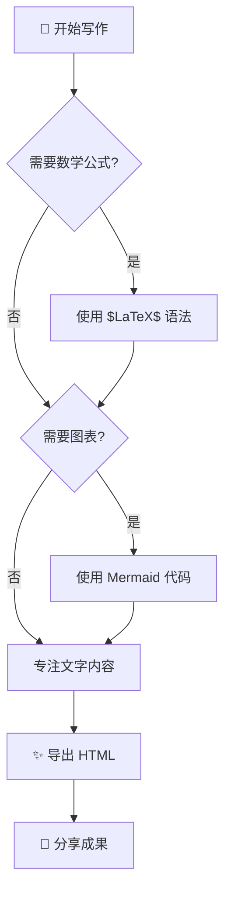

### 时序图

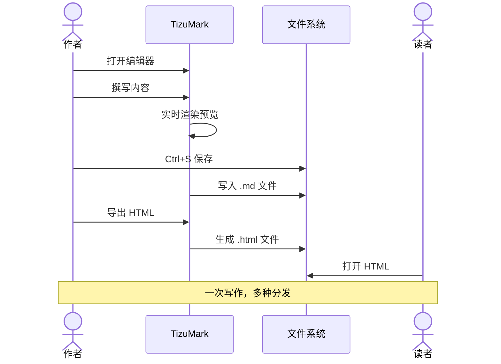

### 甘特图

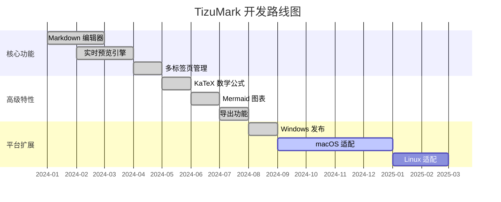

### 类图

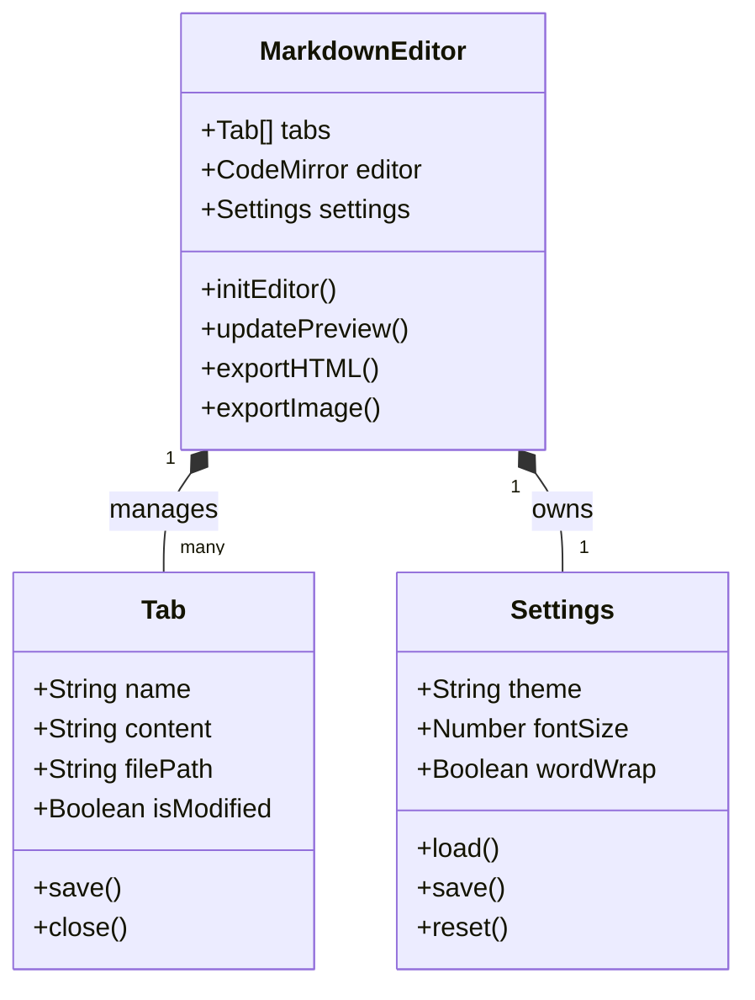

### 状态图

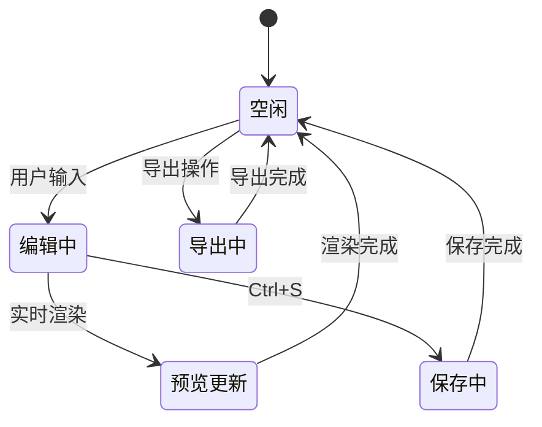

---

## 提示框（Callout）

TizuMark 支持 GitHub 风格的提示框，让文档中的注意事项更加醒目。

> [!NOTE]
> 这是一个**普通提示**。TizuMark 当前仅支持 Windows 平台，macOS 和 Linux 版本正在开发中。

> [!TIP]
> **效率技巧**：直接拖拽 `.md` 文件到 TizuMark 窗口即可快速打开，支持多文件同时拖入。你还可以用 `Ctrl+K` 快速插入超链接。

> [!IMPORTANT]
> **重要提醒**：TizuMark 会在关闭未保存的文件时弹出提醒，防止误操作导致内容丢失。但建议养成经常按 `Ctrl+S` 的好习惯。

> [!WARNING]
> **性能警告**：导出超大文档（超过 10 万行）为长图时，可能会消耗较多内存。建议大文档分段导出，或使用 HTML 导出代替。

> [!CAUTION]
> **安全注意**：TizuMark 导出的 HTML 文件是自包含的独立网页，可以安全分享给他人。但在分享前，请检查文档中是否包含敏感信息（如密钥、密码等）。

---

## 水平分隔线

三条以上的横线可以完美分隔文档的不同部分：

---

上面是一条水平线，下面也是一个全新的内容区域。

---

## Emoji 表情

TizuMark 支持内置 Emoji 短代码。在编辑器中输入短代码，预览中会渲染为表情符号：

| 短代码 | 表情 | 含义 |
|---|---|---|
| `:smile:` | :smile: | 微笑 |
| `:heart:` | :heart: | 爱心 |
| `:rocket:` | :rocket: | 火箭 |
| `:star:` | :star: | 星星 |
| `:fire:` | :fire: | 火焰 |
| `:bulb:` | :bulb: | 灯泡 |
| `:check:` | :check: | 勾选 |
| `:warning:` | :warning: | 警告 |
| `:coffee:` | :coffee: | 咖啡 |
| `:computer:` | :computer: | 电脑 |
| `:book:` | :book: | 书本 |
| `:tada:` | :tada: | 庆祝 |

> 支持 90+ 内置常用短代码，不在列表中的短代码按原样显示（不会转换）。

---

## 脚注

TizuMark 支持 Markdown 扩展脚注语法[^1]。

使用脚注可以让你在文档中添加补充说明而不打断正文的阅读流。脚注通常出现在文档底部，方便读者查阅[^2]。

[^1]: 这是脚注一的内容。脚注可以包含任何 Markdown 格式：**粗体**、*斜体*、`代码` 等。

[^2]: 这是脚注二的内容。脚注非常适合添加引用来源、补充说明和额外信息。

---

## 更多图表类型

TizuMark 支持 Mermaid 所有常用图表。以下展示更多图表类型：

### ER 图

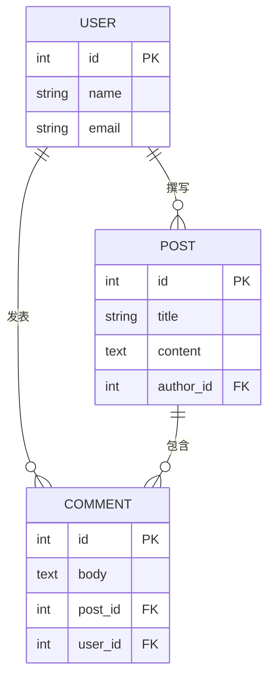

### 饼图

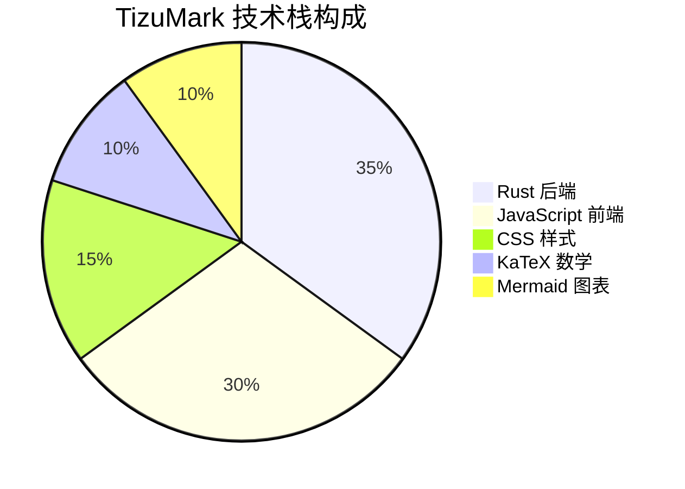

### Git 图

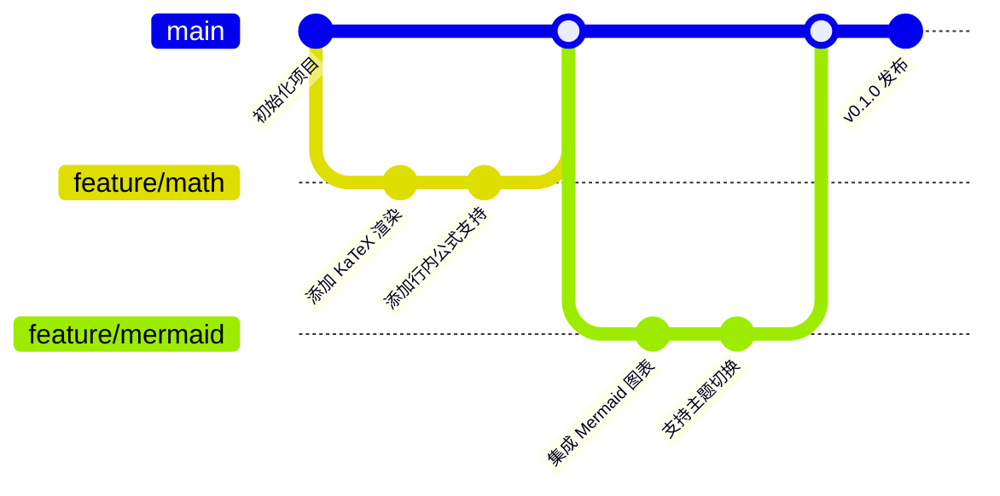

### 用户旅程图

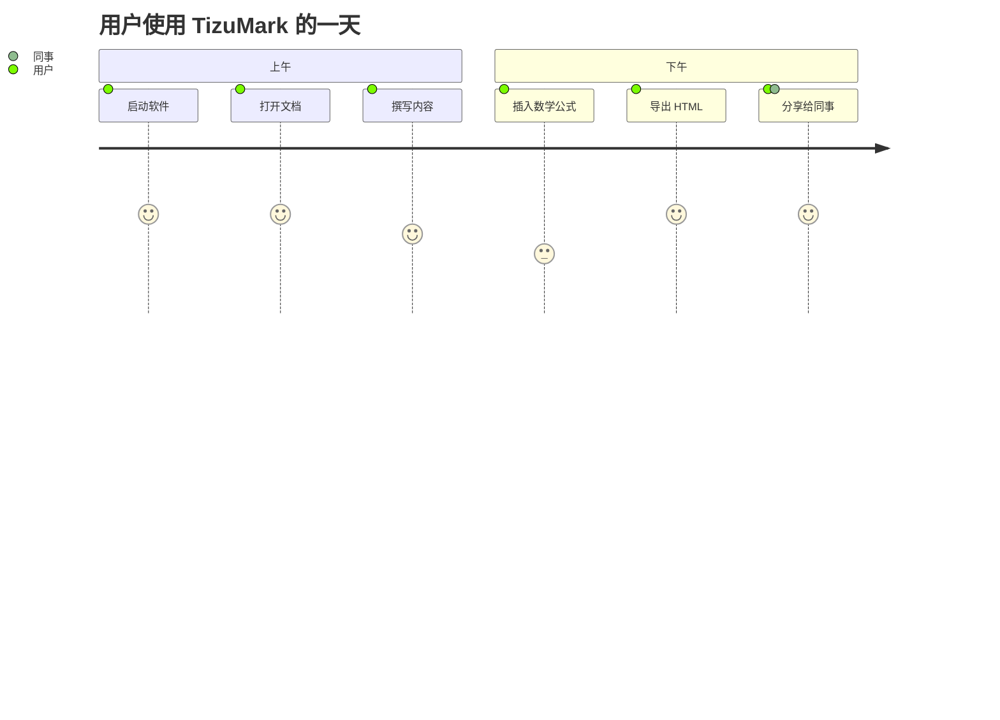

---

## 其他 Markdown 扩展

### 按键标签

使用 `<kbd>` 标签展示键盘按键：

按下 <kbd>Ctrl</kbd> + <kbd>S</kbd> 保存文件，<kbd>Ctrl</kbd> + <kbd>F</kbd> 查找内容。

### 缩写词

TizuMark 支持缩写词标注（鼠标悬停查看释义）：

*[HTML]: HyperText Markup Language — 超文本标记语言
*[CSS]: Cascading Style Sheets — 层叠样式表
*[GFM]: GitHub Flavored Markdown — GitHub 风格 Markdown
*[TOC]: Table of Contents — 文档目录

HTML、CSS 和 GFM 都是 Web 技术的基础。TizuMark 使用 GFM 作为默认 Markdown 方言。

### 转义字符

当需要在 Markdown 中显示特殊字符本身而非其格式化含义时，使用反斜杠 `\` 转义：

| 转义写法 | 显示效果 |
|----------|----------|
| `\*` | \*星号不再是斜体\* |
| `\#` | \# 井号不再是标题 |
| `\[` | \[ 不再被解析为链接 |
| ``\` `` | \` 不再解析为代码 |
| `\\` | \\ 反斜杠本身 |

### HTML 实体

TizuMark 支持 HTML 实体字符：

- 版权符号：`&copy;` → &copy;
- 商标符号：`&reg;` → &reg;
- 小于号：`&lt;` → &lt;
- 大于号：`&gt;` → &gt;
- 与符号：`&amp;` → &amp;

---

## 嵌套与混合排版

### 列表中的代码块

1. 第一步：编写 Markdown

   ```javascript
   // 在列表项中嵌入代码块
   const content = '# Hello\n\nWorld!';
   ```

2. 第二步：预览渲染效果
3. 第三步：导出为 HTML

### 引用中的列表

> **项目规划**：
> - [x] 完成核心编辑器
> - [x] 集成 KaTeX 和 Mermaid
> - [ ] 适配 macOS 和 Linux
> - [ ] 移动端版本

### 引用中的代码

> 在 TizuMark 中构建项目：
>
> ```shell
> npm run build
> ```
>
> 构建产物位于 `src-tauri/target/release/`。

### 表格中的格式

| 特性 | 语法示例 | 渲染效果 |
|------|----------|----------|
| 加粗 | `**重要**` | **重要** |
| 代码 | `` `const x = 1` `` | `const x = 1` |
| 链接 | `[链接](url)` | [TizuMark](https://gitee.com/tizu/tizu-mark) |
| 图片 | `` | 表格中不推荐放图片 |

---

## 综合演示

下面是一段综合运用多种语法的实际文档片段，模拟一篇技术博客的排版效果：

### 为什么选择 Rust 构建桌面应用？

在开发 TizuMark 时，我们选择了 ==Rust + Tauri== 作为底层架构。这个决定带来了几个关键优势：

| 维度 | 传统方案 | Rust + Tauri |
|---|---|---|
| 内存占用 | 150 - 300MB | **< 50MB** |
| 安装包大小 | 80 - 150MB | **< 10MB** |
| 启动速度 | 3 - 8 秒 | **< 1 秒** |

这套架构的核心在于 Tauri v2 使用了系统自带的 WebView 组件，而不是像传统方案那样 ==捆绑一整个浏览器内核==。内存开销的降低不是靠魔法的优化技巧，而是来自架构层面的正确选择。

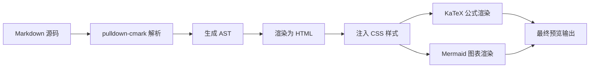

如果你在写技术文档，可以自然地插入数学公式：

$$
O(1) < O(\log n) < O(n) < O(n \log n) < O(n^2) < O(2^n)
$$

> [!TIP]
> **写作建议**：好的技术文档是"分层"的——正文讲核心逻辑，脚注补充细节[^1]，引用块标注出处，提示框强调要点。TizuMark 让你轻松写出层次分明的专业文档。

---

<p align="center">
  <b>✨ 这就是 TizuMark 的全部语法能力 ✨</b><br><br>
  如果觉得好用，欢迎给项目点一个 ⭐ Star！<br>
  有使用问题？加 QQ群 <b>1035294939</b> 或前往 <a href="https://gitee.com/tizu/tizu-mark/issues">Issues</a> 反馈
</p>
