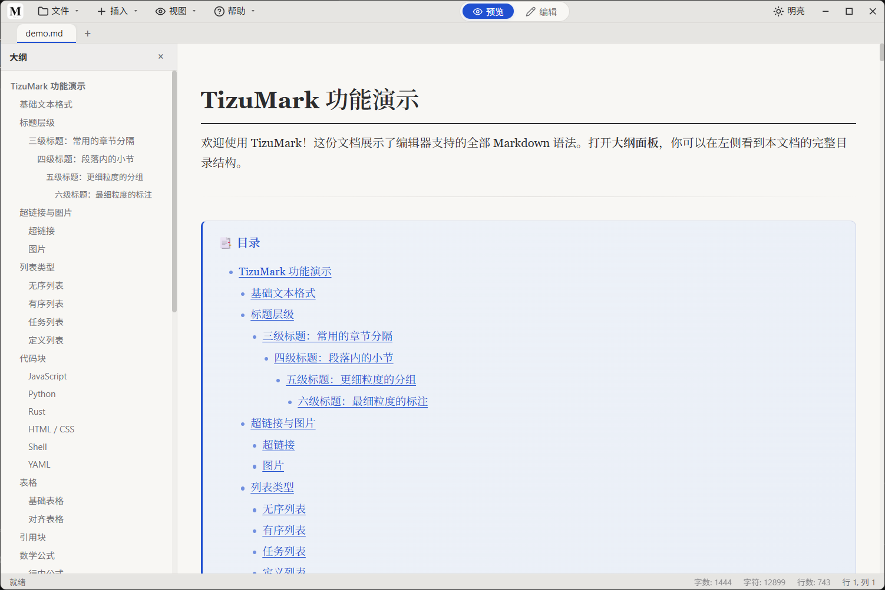
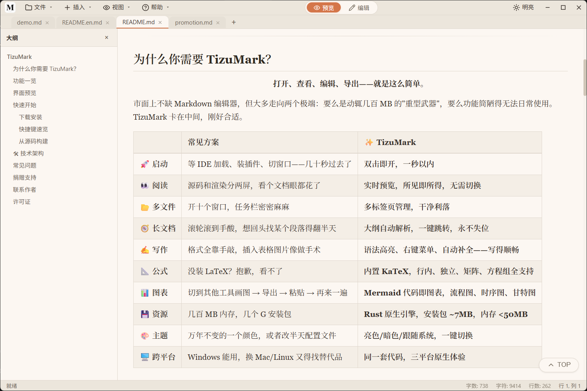
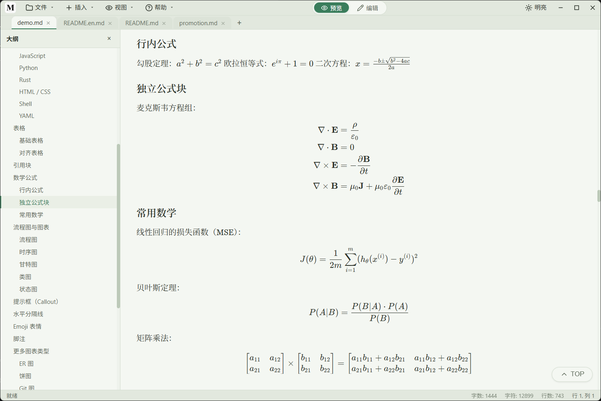
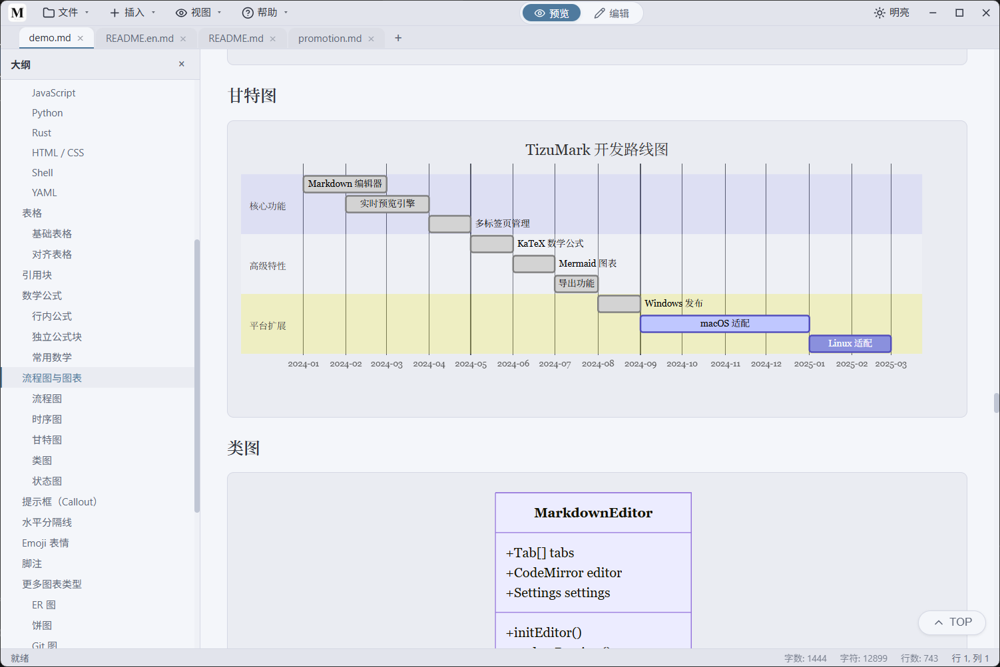
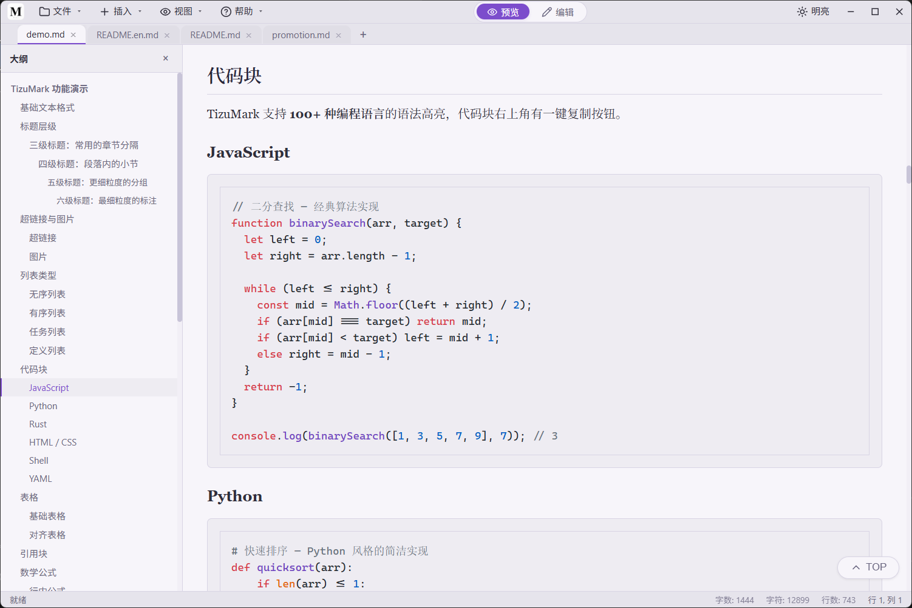
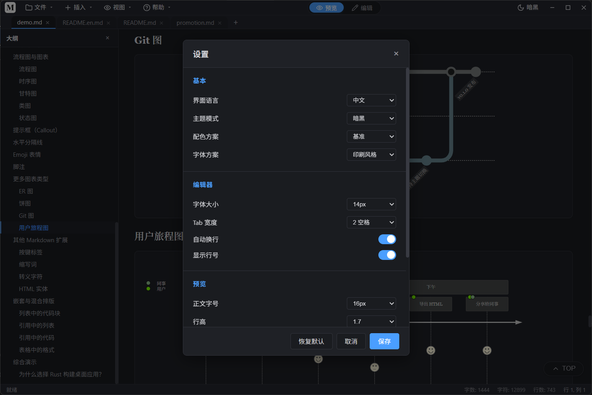
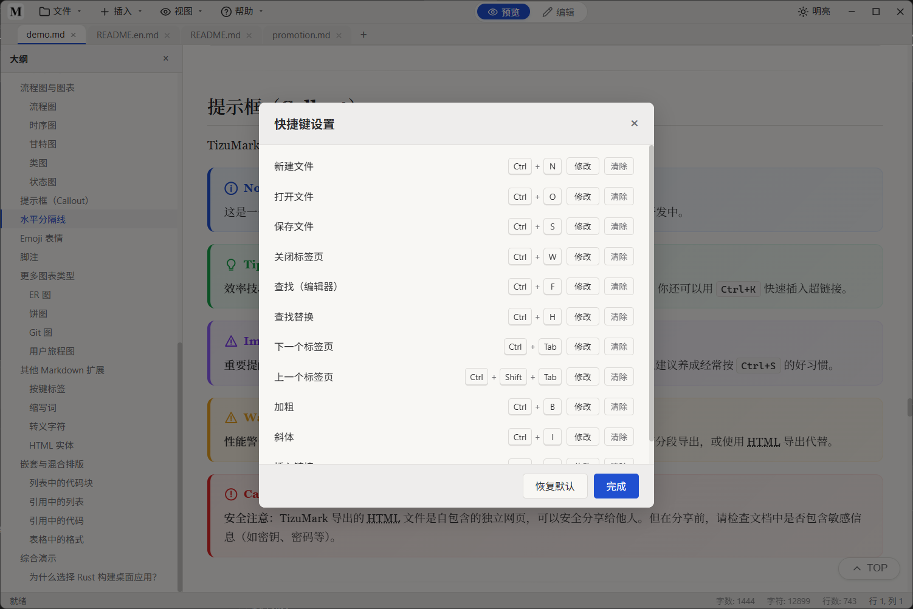
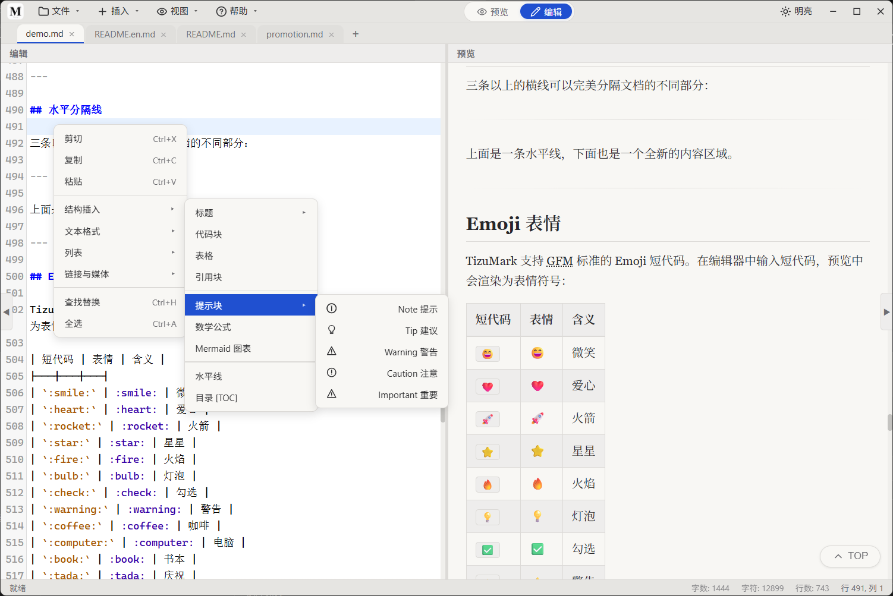

# 受够了 VS Code 和 Typora？这个仅 7MB 的开源 Markdown 编辑器，一个人撸出来了

打开 VS Code 想写个文档，等了十秒它还在加载。装了一堆插件，内存轻松上 500MB。

用 Typora 吧，确实轻。但它是收费的，而且好久没更新了。

市面上 Markdown 编辑器那么多，怎么就找不到一个**轻量、免费、功能全**的？

**TizuMark**。

---

## 有多轻？

| | VS Code | Typora | TizuMark |
|---|---|---|---|
| 安装包 | 80~150 MB | 30~50 MB | **~7 MB** |
| 内存占用 | 300~800 MB | 200 MB+ | **< 50 MB** |
| 启动速度 | 3~8 秒 | 1~2 秒 | **< 1 秒** |
| 许可证 | MIT（但插件生态膨胀） | **收费**（¥88） | **开源免费 GPL-3.0** |

安装包 7 MB，一张手机照片都比它大。内存占用不到 50 MB，开十个浏览器标签都比它多。

凭什么这么小？TizuMark 用 **Rust + Tauri v2** 构建，使用系统原生 WebView，而不是像 Electron 那样把整个 Chromium 打包进去——**架构上的降维打击**，从一开始就选择了正确的方式。

---

## 写起来很舒服

**实时预览，同步滚动** — 左边写，右边看。光标指到哪，预览跟到哪。不需要切换模式，不需要刷新页面。

**多标签页管理** — 同时打开十个文件，一个窗口搞定，标签栏像浏览器一样干净利落。

**大纲导航** — 长文档自动解析标题结构，侧边栏一键跳转，再也翻不到头。

---

## 数学、图表、代码——全内置

大多数 Markdown 编辑器只能写写文字，遇到公式、流程图、代码块就歇菜了。TizuMark 把这些全部内置：

**KaTeX 数学公式** — `$E=mc^2$` 行内公式，`$$\sum_{i=1}^n i^2$$` 独立公式，矩阵、方程组，全支持。不需要装 LaTeX，打开即用。

**Mermaid 代码即图表** — 写几行代码自动渲染成流程图、时序图、甘特图、状态图、饼图。不需要其他工具，不需要截图粘贴。

**代码块语法高亮** — 100+ 编程语言自动识别着色，导出时样式完整保留。

**GFM 完整语法 + 额外能力：**

| 能力 | 说明 |
|---|---|
| 任务列表 | `- [ ]` `- [x]` 可在预览中勾选 |
| 提示块 | Note / Tip / Warning / Caution / Important |
| 高亮标记 | `==文本==` 一键高亮 |
| 定义列表 | 术语：定义 格式 |
| Emoji 短代码 | `:rocket:` → 🚀 |
| 表格、引用、超链接、图片 | 全支持 |

---

## 亮色/暗色一键切换

白天用亮色，晚上用暗色，或者让系统自动决定。不只是一个颜色翻转，编辑器和预览区的全部样式都会匹配当前主题。

---

## 导出也能打

- **导出 HTML** — 独立的网页文件，KaTeX 公式、Mermaid 图表、代码高亮全部保留。无需联网加载任何外部资源，发给谁都能直接打开
- **导出高清长图 PNG** — 宽度固定 800px，高度自适应，暗色/亮色可变。发公众号、知乎、CSDN 都好看

---

## 更多细节

**快捷键全部可自定义** — 内置一套常用快捷键（Ctrl+B 加粗、Ctrl+I 斜体、Ctrl+S 保存等），但如果不符合你的习惯，打开快捷键设置面板直接修改。点击「修改」，按下新组合键，立刻生效。

**插入菜单，不用背语法** — 插入表格、代码块、提示块、目录、数学公式，不用手敲 Markdown 语法。点一下「插入」按钮，模板自动填充到编辑器。记不住 `[]` 还是 `()`？不用记。

- 自动保存 — 写着写着断电？不存在的
- 右键菜单 — 编辑区、预览区、标签页，三处各有所需
- 字体、行高、内容宽度全可调
- 命令行打开 — `tizumark README.md` 直接开干
- 拖入即开，批量打开

无需注册账号，无需联网，完全离线可用。代码开源（GPL-3.0），不用担心隐私问题。

---

## 下载

目前支持 **Windows**（macOS 和 Linux 即将推出）。

- GitHub：https://github.com/tizuio/TizuMark/releases
- Gitee（国内快）：https://gitee.com/tizu/tizu-mark/releases

下载安装包，双击，一秒打开，开写。

**TizuMark — 轻得不像话，快得刚刚好。**
