# 仅 7MB，开源免费，这个 Markdown 编辑器比 VS Code 快 10 倍

启动 VS Code 写个文档，先喝口水等它加载完。装了语法高亮、预览、格式化几个插件，内存轻松飙到 500MB。我只是想写个 Markdown，不是要开一个 IDE。

Typora 确实轻，但 2026 年了，一个文本编辑器还要付费 ¥88。而且它开源遥遥无期，功能迭代也越来越慢。

市面上 Markdown 编辑器那么多，怎么就找不到一个**轻量、免费、功能不妥协**的？

**TizuMark。**

---

## 参数不会说谎

| | VS Code | Typora | TizuMark |
|---|---|---|---|
| 安装包 | 80~150 MB | 30~50 MB | **约 7 MB** |
| 内存占用 | 300~800 MB | 200 MB+ | **< 50 MB** |
| 冷启动 | 3~8 秒 | 1~2 秒 | **< 1 秒** |
| 许可证 | MIT | **¥88 付费** | **开源免费 GPL-3.0** |
| 数学公式 | 需插件 | 内置 | 内置（KaTeX） |
| 图表 | 需插件 | ✗ | 内置（Mermaid） |
| 自动更新 | 需手动 | 有 | **内置（自动检查 + 一键升级）** |
| 中文界面 | 需汉化 | 内置 | **原生中文（兼英文）** |

7 MB 是什么概念？一张手机照片都比它大。内存占用不到 50 MB，Chrome 开一个标签页都比它多。

凭什么这么小？**Rust + Tauri v2**，使用系统原生 WebView，而不是像 Electron 那样把整个 Chromium 打包进去。不是优化出来的，是架构决定的。

---

## 写起来很舒服

**实时预览 + 同步滚动** — 左边写右边看，光标指到哪预览跟到哪。不需要切换模式。

**多标签页管理** — 同时打开十几个文件，一个窗口搞定，比浏览器还清爽。标签太多时还能左右滚动，不会挤成一团。

**大纲导航** — 长文档自动解析标题结构，侧边栏一键跳转，上万字的文档也不会翻不到头。大纲支持折叠子树、宽度可拖拽调节、可整体隐藏，怎么顺手怎么来。

**文件树侧边栏** — 不只是单文件，还能直接「打开文件夹」把整个工作区装进来。目录树随时浏览，文件在外部被增删也会自动刷新。

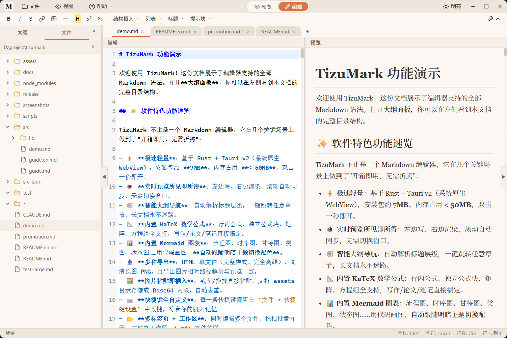

---

## 数学、图表、代码——全部内置

大多数 Markdown 编辑器只能写写文字，遇到公式、流程图、代码块就歇菜了。TizuMark 把这些全部内置，零配置：

**KaTeX 数学公式** — `$E=mc^2$` 行内公式，`$$\sum_{i=1}^n i^2$$` 独立公式，矩阵、方程组，全支持。不需要装 LaTeX，打开即用。

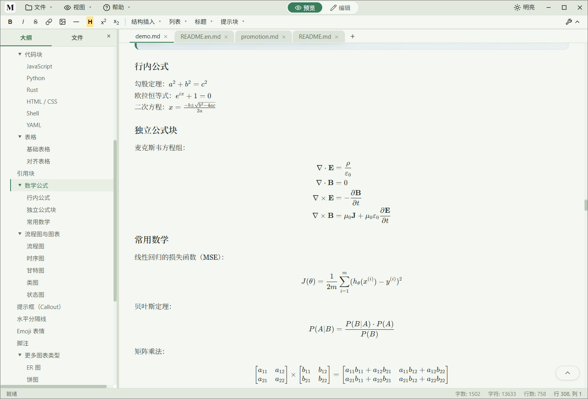

**Mermaid 即写即得** — 几句话自动渲染成流程图、时序图、甘特图、状态图、饼图。不需要截图贴图，不需要切换工具。

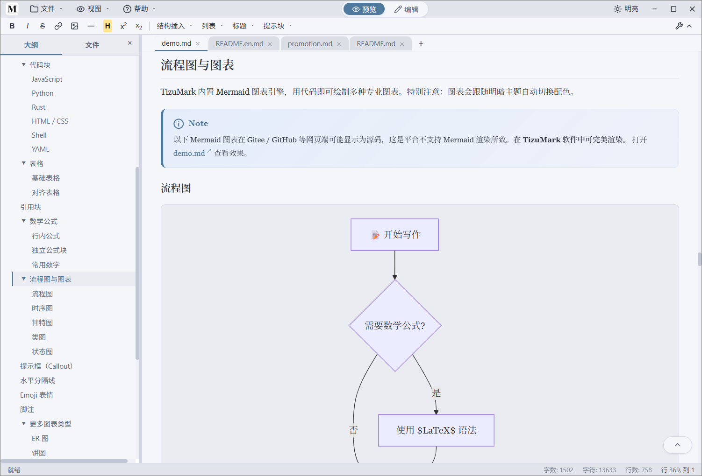

**代码块语法高亮** — 100+ 编程语言自动识别着色，写 Rust、Python、JavaScript 都能正确高亮，导出时样式也完整保留。还可以按需开启代码块行号、代码自动换行。

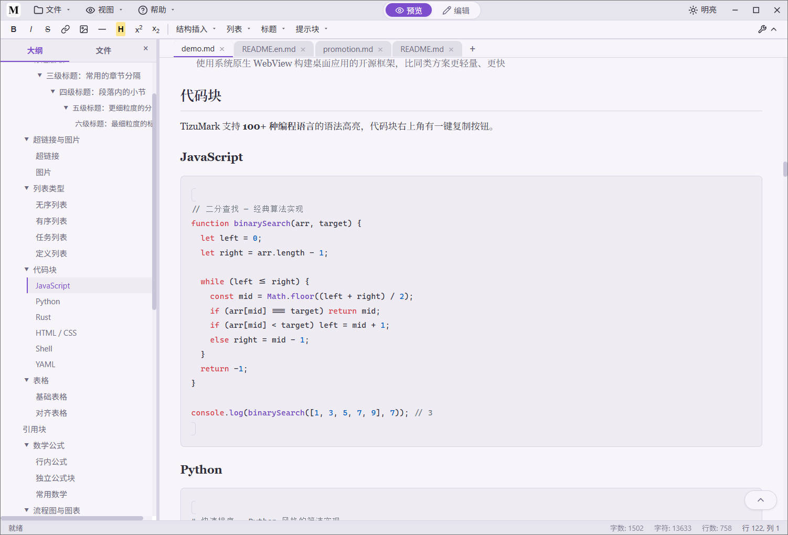

**GFM 完整语法 + 额外能力：**

| 能力 | 说明 |
|---|---|
| 任务列表 | `- [ ]` `- [x]` 完整支持 |
| 提示块 | Note / Tip / Warning / Caution / Important 五种 |
| 高亮标记 | `==文本==` 一键高亮 |
| 上标 / 下标 | `x^2^` `H~2~O` |
| 定义列表 | 术语 -> 定义 格式 |
| Emoji 短代码 | `:rocket:` → 🚀 |
| 目录 | `[TOC]` 自动生成大纲目录 |
| 缩写 | `*[HTML]: HyperText...` |
| 智能标点 | 自动优化中英文标点 |
| 表格、引用、链接、图片 | 全支持 |

---

## 亮色 / 暗色，主题随心

白天亮色，晚上暗色，或者跟系统走。不是简单的颜色翻转，整个编辑器界面和预览区都会完整适配。

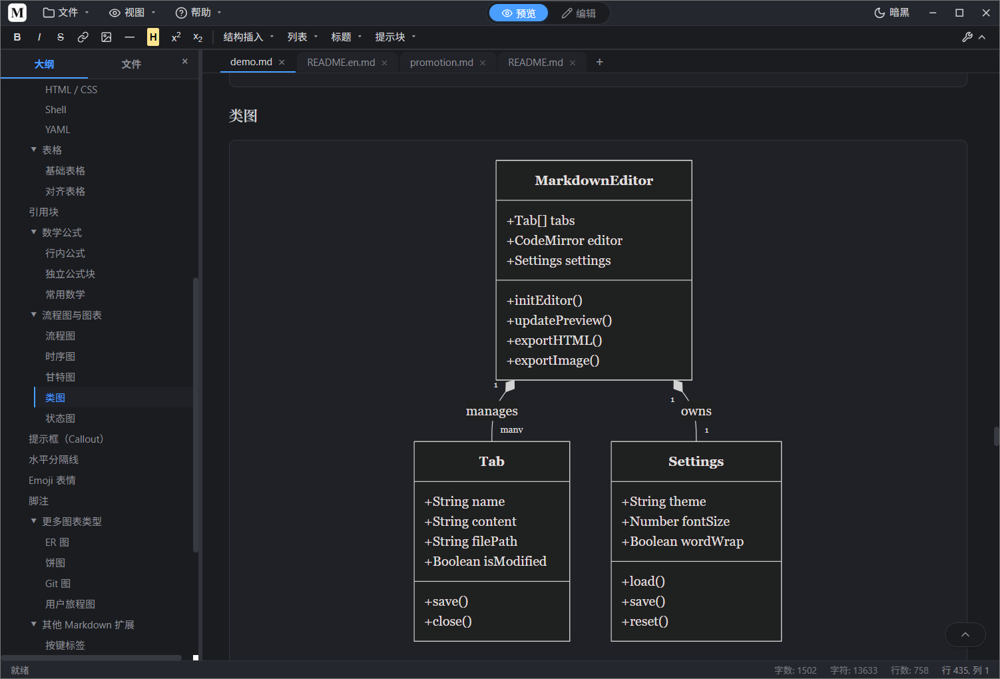

**5 套配色方案** — 基准、暖橙风、翠林风、极夜风、暮紫风，总有一款对胃口。

**字体方案 + 自定义字体** — 内置「简约风格」与「印刷风格」两套字体方案；更可以**导入你自己下载的字体文件**（ttf / otf / woff 等），分别指定编辑器字体与预览字体，连字体预览都给你准备好了。想用思源黑体、霞鹜文楷还是任何小众字体，装进去就行。

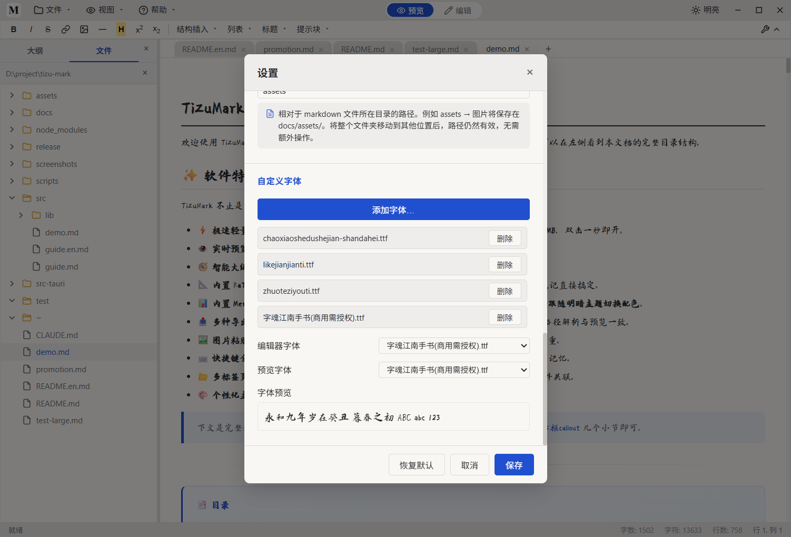

---

## 导出能力

- **导出 HTML** — 独立的网页文件，KaTeX 公式、Mermaid 图表、代码高亮全部保留。不依赖任何外部资源，发给谁都能直接打开
- **导出长图 PNG** — 宽度 800px，高度自适应。发公众号、知乎、CSDN 都好看，不用在浏览器里截长图了
- **导出 PDF** — 调用系统打印直接生成 PDF，可自由设置页眉页脚、背景图形，排版所见即所得

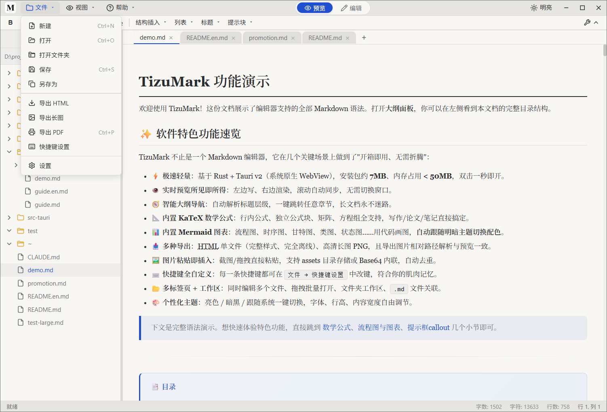

---

## 富格式工具栏，不用背语法

加粗、斜体、删除线、链接、图片、水平线、高亮、上标、下标，常用操作一键完成。还有「结构插入」下拉：表格、代码块、引用块、数学公式、Mermaid、目录，模板自动填入；列表、六级标题、五种提示块也都触手可及。记不住 `[]` 还是 `()`？不用记。

---

## 快捷键全部可自定义

Ctrl+B 加粗、Ctrl+I 斜体、Ctrl+S 保存……如果不符合习惯，打开快捷键面板直接改。点击「修改」，按下新组合键，立刻生效。

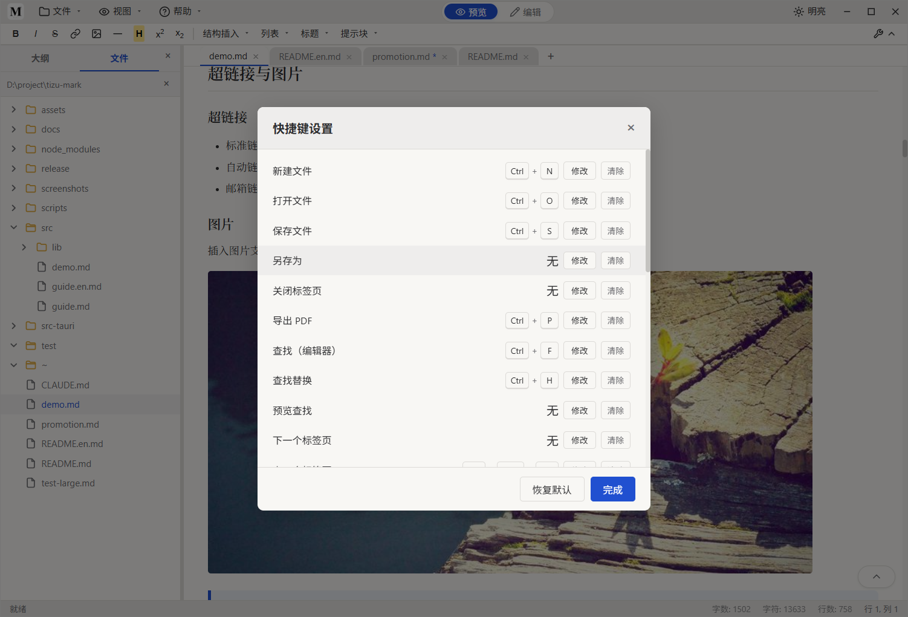

---

## 图片管理，省心不啰嗦

- **粘贴图片自动去重**（MD5 哈希），同一图片不重复存储
- 支持**本地图片**与**网络图片**两种来源
- 存储方式可选「复制到 assets/」或「Base64 嵌入」，前者轻量利于版本管理，后者单文件即可分享
- 图片路径支持**相对路径**（移动文件夹不失联）与**绝对路径**两种模式

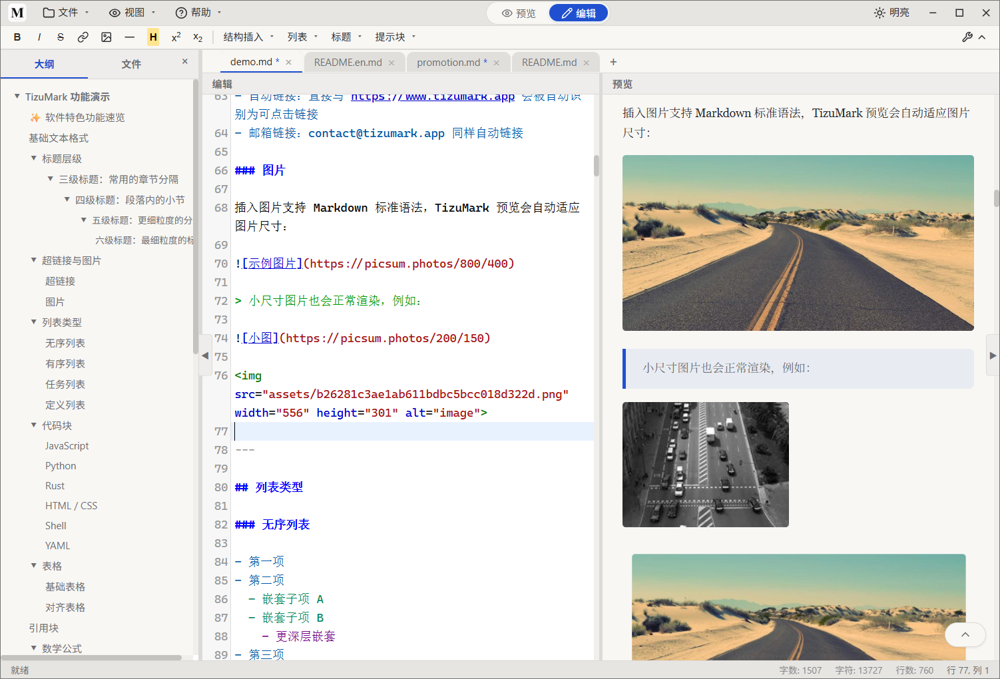

---

## 查找替换，哪里都能搜

编辑器内查找替换，支持区分大小写与正则表达式，一键替换全部；预览区同样可以就地查找，长文定位不再靠肉眼。

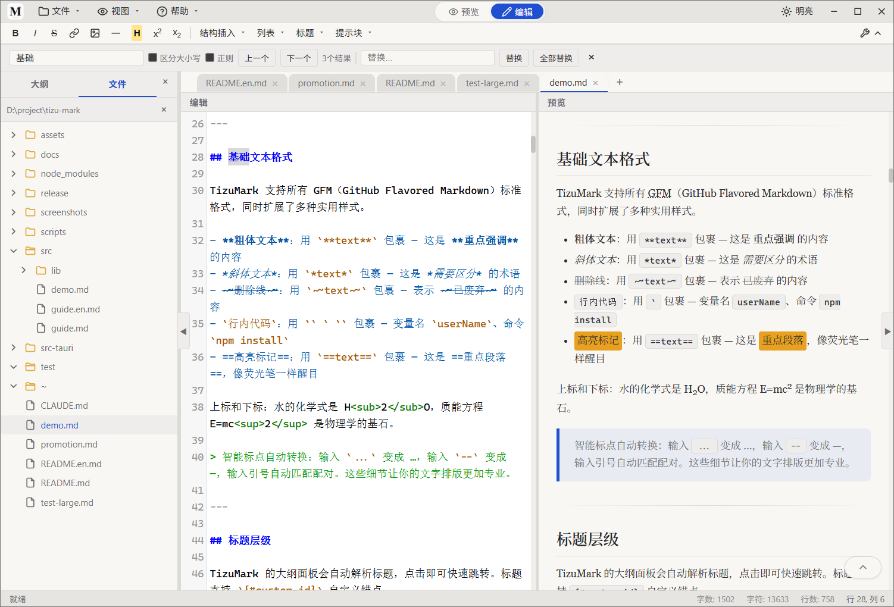

---

## 超大文档也不卡

写小说、记笔记、整理资料，文档越来越长是常态。TizuMark 对超大文档做了专门的渲染优化：分块渲染、围绕焦点窗口化预览、纯预览模式虚拟滚动，再长的文档也能流畅写作、随时跳转，不会因为一次渲染卡死整个界面。

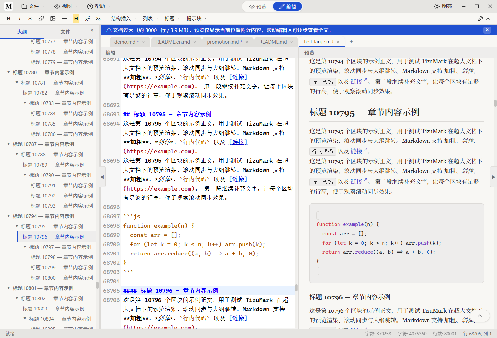

---

## 细节决定体验

**文件关联** — 双击 `.md` 文件直接用 TizuMark 打开

**拖入即开，批量打开** — 把文件或整个文件夹拖进窗口就能打开

**外观全可调** — 字体、字号、行高、内容最大宽度、行号、自动换行，全部可设置

**右键专属菜单** — 编辑区、预览区、标签页各有自己的右键菜单，复制为 HTML、复制文件路径、关闭其他标签……各取所需

**外部变更检测** — 文件被别的程序改了，顶栏会提醒你重新加载或忽略，不会悄悄覆盖你的改动

**会话恢复** — 关掉再打开，上次的文件和进度都还在

**安静的自动更新** — 启动后静默检查，有新版本弹框提示并带下载进度，一键升级，不打扰

**中英双语界面** — 中文 / English 随时切换，给海外的朋友也用得惯

无需注册账号，无需联网，完全离线可用。代码开源（GPL-3.0），后端用 Rust 对渲染内容做 HTML 净化、防 XSS，不用担心隐私与安全问题。

---

## 下载

目前支持 **Windows**，macOS 和 Linux 即将推出。

- Gitee（国内快）：https://gitee.com/tizu/tizu-mark/releases
- GitHub：https://github.com/tizuio/TizuMark/releases

下载安装包 → 双击 → 一秒打开 → 开写。

**TizuMark — 轻得不像话，快得刚刚好。**
