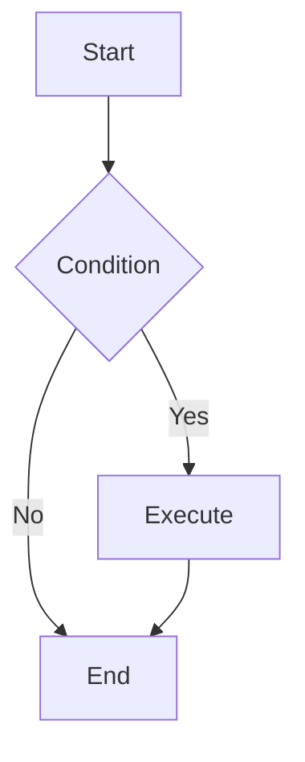
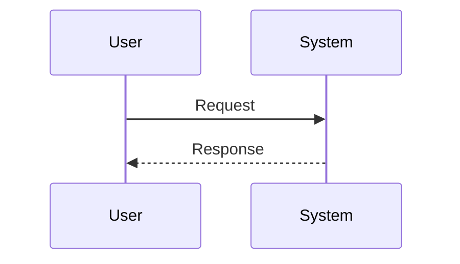

# MarkFlow User Guide

## Quick Start

### Basic Operations

1. **New File** - Click "File → New" or press `Ctrl+N`
2. **Open File** - Click "File → Open" or press `Ctrl+O`, supports batch opening
3. **Save File** - Click "File → Save" or press `Ctrl+S`
4. **Save As** - Click "File → Save As" to save a copy

### Editor Features

#### View Modes

- **Preview Mode** - Hide editor, full-screen document preview
- **Edit Mode** - Show editor and preview in split view

#### Outline Navigation

1. Click "View → Outline" to enable sidebar
2. Automatically detects heading hierarchy in document
3. Click headings to quickly jump to that section

#### Find & Replace

- **Find** - `Ctrl+F` to open find panel
- **Replace** - `Ctrl+H` to open find & replace panel
- Supports case-sensitive and regex options

### Keyboard Shortcuts

| Shortcut | Action |
|----------|--------|
| `Ctrl+N` | New File |
| `Ctrl+O` | Open File |
| `Ctrl+S` | Save File |
| `Ctrl+W` | Close Tab |
| `Ctrl+F` | Find |
| `Ctrl+H` | Find & Replace |
| `Ctrl+Tab` | Next Tab |
| `Ctrl+Shift+Tab` | Previous Tab |
| `Esc` | Close Dialog/Panel |

> All shortcuts can be customized in "File → Keyboard Shortcuts"

### Drag & Drop Support

Drag `.md` files directly into the window to open them. Supports multiple files at once.

### Export Options

1. **Export HTML** - "File → Export HTML" generates a shareable webpage file
2. **Export Image** - "File → Export Image" generates a high-quality long image for social media

## Markdown Syntax

### Basic Syntax

```markdown
# Heading 1
## Heading 2
### Heading 3

**Bold text**
*Italic text*
~~Strikethrough~~

- Unordered list
1. Ordered list

[Link text](https://example.com)


> Blockquote

`Inline code`

---

| Header 1 | Header 2 |
|----------|----------|
| Cell 1   | Cell 2   |
```

### Code Blocks

Wrap code with triple backticks and specify the language:

````markdown
```javascript
function hello() {
  console.log('Hello MarkFlow!');
}
```
````

Supported languages: JavaScript, Python, Rust, HTML, CSS, Shell, YAML, and more.

### Math Formulas

Inline formula: $E = mc^2$

Display formula:

$$
\sum_{i=1}^{n} i = \frac{n(n+1)}{2}
$$

**Source syntax:**

Inline: `` `$E = mc^2$` ``

Display:
```
$$
\sum_{i=1}^{n} i = \frac{n(n+1)}{2}
$$
```

### Flowcharts



### Emoji

Insert emoji using shortcodes:

- `:smile:` → 😄
- `:heart:` → ❤️
- `:thumbsup:` → 👍
- `:rocket:` → 🚀
- `:fire:` → 🔥

For more emoji, see the GitHub Emoji list.

## Theme Settings

### Switch Theme

Click the theme button in the toolbar to switch between Light/Dark modes.

### Follow System

In "File → Settings", select "Follow System" to automatically switch themes with system settings.

## Preview Enhancements

### Math Formula Rendering

Supports KaTeX math formulas:
- Inline: `$...$`
- Display: `$$...$$`
- LaTeX environments: `\begin{equation}...\end{equation}`

### Mermaid Diagrams

Supports flowcharts, sequence diagrams, Gantt charts, and more:



### Code Highlighting

Code blocks are automatically syntax-highlighted with support for 100+ programming languages.

## FAQ

### Q: How to restore default settings?

Click the "Restore Default" button in "File → Settings" or "File → Keyboard Shortcuts".

### Q: What file formats are supported?

Supports `.md`, `.markdown`, and `.txt` files.

### Q: How to report issues?

Visit the project repository to submit an Issue or Pull Request.

## License

MIT License
