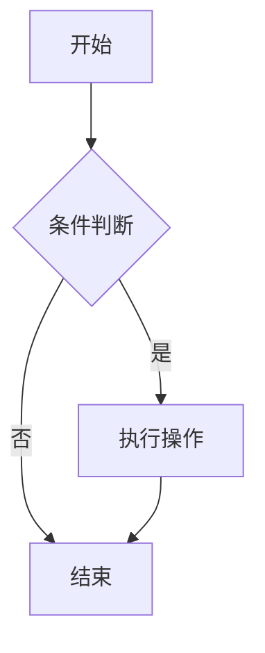
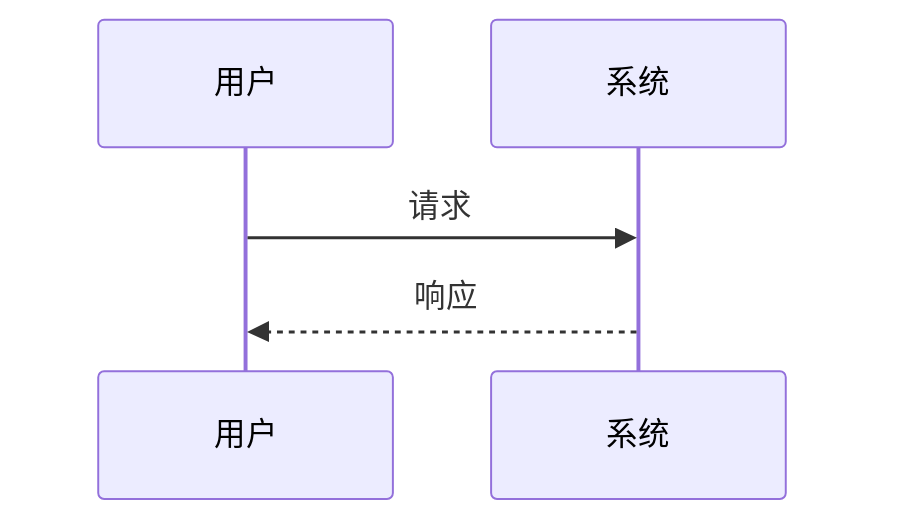

# MarkFlow 使用说明

## 快速开始

### 基本操作

1. **新建文件** - 点击「文件 → 新建」或按 `Ctrl+N`
2. **打开文件** - 点击「文件 → 打开」或按 `Ctrl+O`，支持批量打开
3. **保存文件** - 点击「文件 → 保存」或按 `Ctrl+S`
4. **另存为** - 点击「文件 → 另存为」保存副本

### 编辑器功能

#### 视图切换

- **预览模式** - 隐藏编辑器，全屏预览文档
- **编辑模式** - 显示编辑器和预览双栏

#### 大纲导航

1. 点击「视图 → 大纲」开启侧边栏
2. 自动识别文档中的标题层级
3. 点击标题可快速跳转到对应位置

#### 查找替换

- **查找** - `Ctrl+F` 打开查找面板
- **替换** - `Ctrl+H` 打开查找替换面板
- 支持区分大小写、正则表达式

### 快捷键

| 快捷键 | 功能 |
|--------|------|
| `Ctrl+N` | 新建文件 |
| `Ctrl+O` | 打开文件 |
| `Ctrl+S` | 保存文件 |
| `Ctrl+W` | 关闭当前标签页 |
| `Ctrl+F` | 查找 |
| `Ctrl+H` | 查找替换 |
| `Ctrl+Tab` | 切换到下一个标签页 |
| `Ctrl+Shift+Tab` | 切换到上一个标签页 |
| `Esc` | 关闭对话框/面板 |

> 所有快捷键可在「文件 → 快捷键设置」中自定义

### 拖拽支持

直接将 `.md` 文件拖拽到窗口即可打开，支持多文件同时拖入。

### 导出功能

1. **导出 HTML** - 「文件 → 导出 HTML」生成可分享的网页文件
2. **导出长图** - 「文件 → 导出长图」生成高清长图，适合社交媒体

## Markdown 语法

### 基础语法

```markdown
# 标题一
## 标题二
### 标题三

**粗体文本**
*斜体文本*
~~删除线~~

- 无序列表
1. 有序列表

[链接文字](https://example.com)


> 引用文本

`行内代码`

---

| 表头1 | 表头2 |
|-------|-------|
| 内容1 | 内容2 |
```

### 代码块

使用三个反引号包裹代码，并可指定语言：

````markdown
```javascript
function hello() {
  console.log('Hello MarkFlow!');
}
```
````

支持的语言：JavaScript、Python、Rust、HTML、CSS、Shell、YAML 等。

### 数学公式

行内公式：$E = mc^2$

独立公式：

$$
\sum_{i=1}^{n} i = \frac{n(n+1)}{2}
$$

### 流程图



### Emoji 表情

使用短代码插入表情：

- `:smile:` → 😄
- `:heart:` → ❤️
- `:thumbsup:` → 👍
- `:rocket:` → 🚀
- `:fire:` → 🔥

更多表情请参考 GitHub Emoji 列表。

## 主题设置

### 切换主题

点击工具栏的主题按钮，可在明亮/暗黑模式间切换。

### 系统跟随

在「文件 → 设置」中选择「跟随系统」，主题将随系统设置自动切换。

## 预览增强

### 数学公式渲染

支持 KaTeX 数学公式，包括：
- 行内公式：`$...$`
- 独立公式：`$$...$$`
- LaTeX 环境：`\begin{equation}...\end{equation}`

### Mermaid 图表

支持流程图、时序图、甘特图等：



### 代码高亮

代码块自动语法高亮，支持 100+ 种编程语言。

## 常见问题

### Q: 如何恢复默认设置？

在「文件 → 设置」或「文件 → 快捷键设置」中点击「恢复默认」按钮。

### Q: 支持哪些文件格式？

支持 `.md`、`.markdown`、`.txt` 格式的文件。

### Q: 如何反馈问题？

访问项目仓库提交 Issue 或 Pull Request。

## 许可证

MIT License
